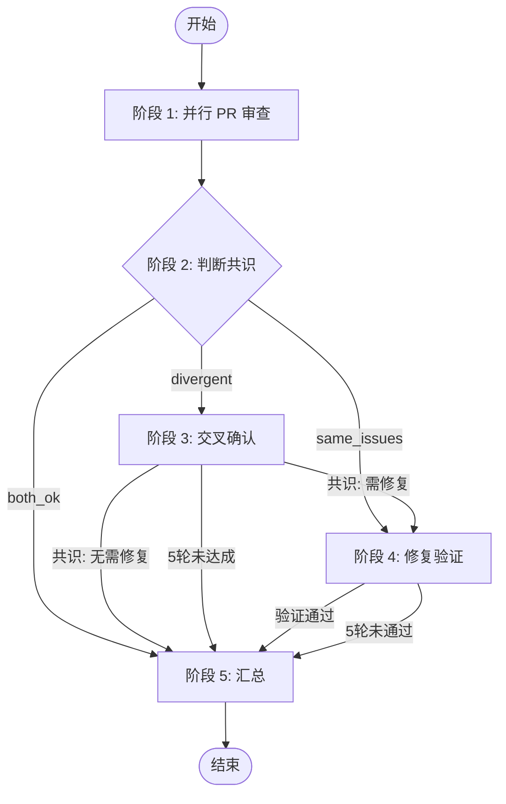
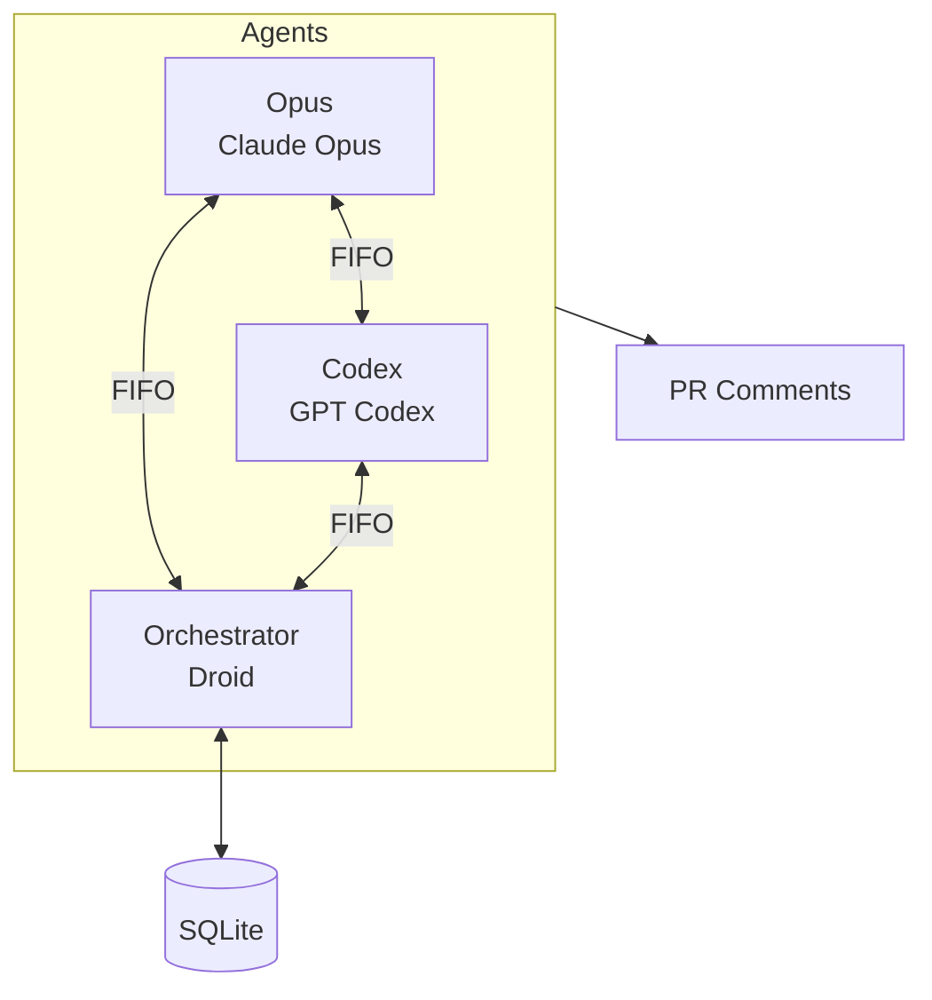

# Duo Review - 双 Agent 交叉审查

双 AI Agent（Opus + Codex）交叉审查 PR，自动判断共识、决定是否需要修复。

## 使用方式

### 本地使用（通过 Droid）

在 PR 分支上启动 Droid，然后说：

```plain
load skill: duoduo
```

或直接说：

```plain
帮我 review 这个 PR
```

Droid 会自动检测当前 PR 并启动审查流程。

### GitHub Actions 自动触发

在仓库配置 workflow 后，每次 PR 创建或更新时自动触发审查。

详见 [.github/workflows/README.md](./.github/workflows/README.md)

### @Mention 触发

在 PR 评论中 @mention bot：

- 发起审查：`@duo-bot 帮我审查一下`
- 重新审查：`@duo-bot 再审一遍`
- 询问问题：`@duo-bot 这个改动安全吗`
- 操作请求：`@duo-bot 删除旧评论`

## 流程概览



## 架构



- **Orchestrator**：编排流程、判断共识（Droid 进程）
- **Opus/Codex**：独立审查、交叉确认、修复验证
- **FIFO**：Agent 间双向通信
- **SQLite**：状态和消息持久化
- **duo-cli**：CLI 工具，用于启动/控制 Agent

## CLI 工具

```bash
# 安装
pipx install git+https://github.com/notdp/duo-cli.git

# 常用命令
duo-cli init              # 初始化审查
duo-cli status            # 查看状态
duo-cli logs orchestrator # 查看日志
duo-cli spawn opus        # 启动 Agent
duo-cli send opus "msg"   # 发送消息
```

详见 [duo-cli README](https://github.com/notdp/duo-cli)

## 文件结构

```plain
.dotfiles/
├── DUODUO.md                    # 本文件
├── .github/workflows/
│   ├── duo-review.yml           # Review workflow
│   ├── duo-mention.yml          # Mention workflow
│   └── README.md                # Workflow 配置说明
└── skills/duoduo/
    ├── SKILL.md                 # Skill 定义
    └── stages/                  # 各阶段指令
        ├── 0-mention-*.md       # @Mention 处理
        ├── 1-pr-review-*.md     # 阶段 1: 并行审查
        ├── 2-judge-*.md         # 阶段 2: 判断共识
        ├── 3-cross-confirm-*.md # 阶段 3: 交叉确认
        ├── 4-fix-verify-*.md    # 阶段 4: 修复验证
        └── 5-summary-*.md       # 阶段 5: 汇总
```
