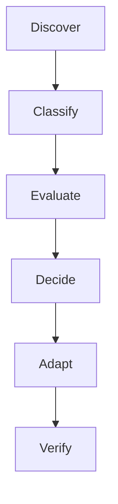

# Refs Absorption Methodology

本文档是从 `refs/` 吸收外部项目经验的 SSOT。`refs/` 是证据源，不是待复制代码库；吸收目标是让本仓库的 agent 架构更稳定、更可验证，而不是扩大 skill 数量。

## Entry Points

- 总览与分类：`docs/refs-summary.md`
- 单项目详情：`docs/refs-details/<owner>/<repo>.md`
- Skill 编写规范：`docs/software-engineering-research/skill-authoring.md`
- Prompt 模式库：`docs/software-engineering-research/skill-patterns.md`

## Absorption Pipeline



1. **Discover**：记录 upstream commit range、变更主题、关键文件和证据路径。
2. **Classify**：把变化归类为 method、workflow、guardrail、script、docs、runtime、dependency。
3. **Evaluate**：按架构适配度、可验证性、上下文成本、安全/副作用、复用频率、维护成本评分。
4. **Decide**：裁决为 absorb、observe、reject、research-later。
5. **Adapt**：改写到当前分层，不平行造入口。
6. **Verify**：运行验证并记录证据。

## Absorption Levels

| Level | 名称 | 含义 | 典型落点 |
|---:|---|---|---|
| L0 | Observe | 只记录，不改变本仓库行为 | `docs/refs-details/` |
| L1 | Document | 写入 refs 总结或研究文档 | `docs/refs-summary.md`、`docs/software-engineering-research/` |
| L2 | Contract | 固化为规范、模式、验收门 | `skill-authoring.md`、`skill-patterns.md`、`guard-*` 文档 |
| L3 | Tooling | 脚本、测试、校验器 | `scripts/`、`scripts/tests/` |
| L4 | Runtime | 新增或修改 skill / command | `skills/`、`commands/` |
| L5 | Global Rule | 所有任务都必须遵守的硬约束 | `agents/AGENTS.md` |

默认从 L0-L2 开始。L4 需要单独说明触发条件、边界和验证；L5 必须非常克制，只有长期、全局、不可下沉到脚本或 skill 的硬约束才允许进入。

## Captured Reference Doc Structure

短参考（micro-ref，非 `refs/` submodule，通常来自用户摘录或单篇文章）写入 `docs/software-engineering-research/` 时，按统一结构写，让它"出生即可提升"，而不是停在散文笔记。模板范例：`conditional-control-risk.md`、`prompt-pressure-risk.md`。

固定章节：

| 章节 | 内容 |
|---|---|
| 核心观点 | 1-3 句事实摘要；来源不可验证时标 `[未验证]` |
| 可迁移模式 / 工程结论 | 把观点转成可操作的 pattern 或规则 |
| 与现有资产映射 | 表格列 `Asset / Relevance / Suggested use`，指向具体 skill / command / hook / doc |
| Adoption level | 当前 L0-L5 级别 + 下一级候选（哪个 asset、什么形式） |
| Usage checklist | 可在相关工作前自检的轻量清单（可选） |
| Premise collapse | 写明把结论过度外推会变成什么错误，划定更窄的正确边界 |

提升与登记：

- 每条 micro-ref 同时在 `docs/refs-micro-index.md` registry 登记，`status` 从 `observe` 起。
- 当 doc 里的"下一级候选"被真正写进目标 asset 后，目标 asset 应**反向引用**该 ref doc，registry `status` 改 `absorbed`，并记证据落点。
- 只登记、目标 asset 不反向引用的，视为 registry-only，仍是 `observe`，不算 `absorbed`。

## Decision Matrix

| 维度 | 高分信号 | 低分信号 |
|---|---|---|
| 架构适配度 | 能落入现有 `docs/skills/commands/scripts` 分层 | 需要新增平行 runtime 或全局注入大量上下文 |
| 可验证性 | 能用测试、脚本、截图、diff 或固定表格验证 | 只能靠“看起来更好”判断 |
| 上下文成本 | 触发时按需读取，主流程短 | 需要每次加载长手册或大量背景 |
| 安全/副作用 | 只读、局部、可回滚 | 触及 secrets、网络、远端、数据库、运行时、医疗/临床 |
| 复用频率 | 高频工作流或反复踩坑 | 只解决一次性偏好 |
| 维护成本 | 规则清晰、依赖少、易测试 | 依赖外部服务、版本敏感、难以长期维护 |

## Risk Gates

| 触发 | 必须路由 |
|---|---|
| Remote / deployment / database / secret / runtime side effect | `/guard-gitops` |
| 新功能 / bug 修复 / 行为变更 | `/dev-tdd` |
| 安全、认证、授权、数据处理、外部依赖边界 | `/guard-secure` |
| UI / CSS / 组件 / 视觉系统 | `fe-*` + `/guard-verify` 视觉证据 |
| 长任务 / batch / dry-run / apply / 复杂 CLI | `/dev-operational-task` |
| 交付前总检查 | `/guard-check` |

## Required Output Format

每次 refs 更新分析必须至少产出下表：

| 项目 | Commit range | 变化主题 | 候选吸收项 | Level | 风险 | 建议动作 | 证据 |
|---|---|---|---|---|---|---|---|
| `<owner>/<repo>` | `<old>..<new>` | `<summary>` | `<pattern>` | L0-L5 | low/medium/high | absorb/observe/reject/research-later | `<path or commit>` |

项目详情文档建议追加：

```markdown
## Recent Update Absorption (<date>)

| Commit range | 变化主题 | 候选吸收项 | Level | 裁决 | 证据 |
|---|---|---|---|---|---|
```

## Adaptation Rules

- 外部 prompt 写“Ask for clarification”时，改成本仓库的 `AskUser` 工具纪律。
- 外部 prompt 写“save as markdown document”时，改为用户明确要求后才创建文档。
- 外部安全扫描结果只能作为对应提交的历史证据，不能当作当前安全状态。
- 外部 workflow 先映射到本仓库现有 `think-*`、`dev-*`、`guard-*`、`fe-*`、`readable-*`、`assist-*`，不要新增竞争入口。
- 可确定性检查优先下沉到 `scripts/` 和测试，不依赖模型自觉执行。

## Reject Rules

- 只因“外部很酷”不吸收。
- 无法验证的行为不进 runtime。
- 需要 secrets、网络、外部 API 的能力不默认启用。
- 与 AskUser、文档创建、gitops、验证门禁冲突时，必须先适配再吸收。
- 外部仓库没有明确 license、来源或安全边界时，默认 observe，不 runtime。

## Batch Refs Update Runbook

1. 记录当前 `git submodule status`。
2. 对每个 ref 记录 old HEAD。
3. 拉取 upstream 并记录 new HEAD。
4. 对 old..new 有提交的 ref，阅读 commit log、关键 diff、README/docs/skills/scripts 变化。
5. 按 Required Output Format 输出裁决。
6. 只更新 docs；L4/L5 候选列为单独待审批项。
7. 运行验证：`bash scripts/run-verify.sh /Users/zhenninglang/.dotfiles` 和 `python3 scripts/scan_diff_residue.py`。

## Premise Collapse

If 本文档没有被 `docs/refs-summary.md` 和 `skill-authoring.md` 引用, then 它会变成孤儿文档，后续吸收仍会漂移；必须先补引用关系再进入 refs 更新分析。

If refs 更新后上游变化规模过大, then 本轮只产出分批吸收建议和优先级，不直接扩大 runtime 改动范围。
