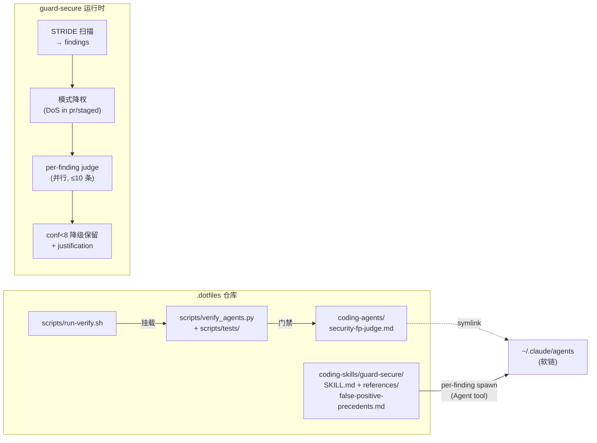

# Spec: subagent 资产形态 + verify 门禁 + guard-secure FP 裁决 phase

- 日期: 2026-06-10
- 状态: 已批准并实现（2026-06-10，commits 7a271cf / a7017a8 / P3）；遗留：security-fp-judge 的新 session 发现性 + tools 收窄 smoke test（定义在 session 启动时加载，本次实现 session 无法自测，验收用了 SKILL.md 7.2 降级路径）
- 读者: 仓库 owner（harness 维护者）
- 来源: `docs/refs-details/voltagent/awesome-claude-code-subagents.md` + `docs/refs-details/anthropics/claude-code-security-review.md` 两份 refs 分析的汇合线
- 思维框架: 类比推理（借两个已验证外部模式补本仓库缺口）+ 模型简化（先 1 个住户验证机制，不铺 154 个角色）

## TL;DR

为本 harness 仓库引入 subagent 资产形态：新建 `coding-agents/` 目录（软链到 `~/.claude/agents`）+ `scripts/verify_agents.py` 机器门禁，首个住户是 `security-fp-judge`（只读误报裁决 subagent），同时把 claude-code-security-review 的误报判例库吸收为 `guard-secure` 的 reference，并给 guard-secure 增加 per-finding 对抗裁决 phase。一次落地补两个缺口：资产形态缺一极（subagent）、guard 族缺负样本知识（误报判例）。

## 已锁定（用户 2026-06-10 拍板）

1. 目录命名 `coding-agents/`，与 `coding-skills/` 对仗；现有 `agents/`（规则层文档）不动。
2. DoS 冲突按模式降权：`pr`/`staged`/`commit-range` 模式下 DoS finding 最高只进"信息性/加固建议"，不阻断合并；`full`/`weekly` 模式 STRIDE D 维度保持全权重。
3. judge confidence < 8 的 finding **降级保留**（降到信息性 + 附 justification），不静默丢弃——与 Truth Directive 一致。
4. judge 模型档位 `model: inherit`（成本可预期优先；接受弱模型会话下裁决质量波动的代价）。
5. 落地顺序：先目录 + 门禁，第一个住户就是 FP 裁决者；不为"有目录"而填充角色（上一轮对话已确认的汇合线）。

## 待决策

（无——4 个决策点已全部拍板；实现中如遇官方机制与假设不符，按"风险与验证"节的 fallback 处理并回报。）

## 可自由裁量

- judge prompt 的具体措辞（结构锁定，见 Phase 1；文案实现时定）
- `verify_agents.py` 的 body 行数 warn 阈值（建议 ≤200，参照上游 154 个 agent 均值 246 行的反面教训）
- acceptance fixture 的具体漏洞样例代码

## 边界

### Goals

- G1: 仓库具备 subagent 资产形态：目录、wiring、文档登记，与 skills/commands 同级待遇。
- G2: subagent 资产从第一天起有机器门禁（frontmatter/tools/model/路径校验），规则不进 CI 必然退化（上游 README 宣称 reviewer 只读、实际 102/154 全量写集的教训）。
- G3: guard-secure 获得误报治理能力：判例库（"不报什么"）+ per-finding 对抗裁决 phase。
- G4: 端到端可验收：用含已知 FP 的样例变更跑 /guard-secure，观察到裁决发生、FP 降级带理由、真问题保留。

### Non-goals

- 不引入角色型 subagent 集合（code-reviewer/debugger 等与现有 skill 路由重叠，明确拒绝）。
- 不做 Droid / Codex 的 subagent 兼容。[未验证] 两者是否有等价机制，列为后续调研项，不阻塞本线。
- 不做 eval 框架/标注集自动回归（上游也没有 ground truth；本仓库判例条目带触发样例即可，自动回归是后续可选项）。
- 不做 GitHub Action / CI pipeline 形态（我们是本地 harness，slash command 版架构已证明 skill 形态零基础设施可达）。
- 不改 guard-threat-model、不动 STRIDE 检查表本体（只加引用和模式降权规则）。

### Constraints

- 软链 wiring 必须沿用既有模式（`~/.claude/skills → coding-skills` 同款），并登记进 README wiring 表。
- 判例库每条必须带来源（upstream file:line）+ 本仓库裁决（吸收/调整/拒绝 + 理由）+ 触发样例；不许无证据照搬。
- 所有进 model context 的新文本（subagent body、判例库）必须有真实机制兜底，不写装饰性协议（上游 133/154 装饰性 Communication Protocol 的反面教训）。
- subagent 文件默认 ASCII 路径、无机器绝对路径（与 verify_skills 同款约束）。

### Boundary facts

- Risk types: context-surface（subagent prompt 与判例库进 model context）、limit-default-fallback（裁决上限、fail-open、降级规则）、schema-contract（judge 输出格式）
- Callers: guard-secure SKILL.md（Phase 3 唯一调用方）；coding-agents/ 目录被 Claude Code 全局加载
- Contract cases: 见"场景化推演"S1-S3
- Data source: findings 来自 guard-secure 自身输出；judge 输入为 finding + 所在文件内容 + 判例库
- Metric route: not applicable
- Schema contract: judge 返回 `verdict(keep|demote) / confidence(1-10) / justification` 固定三字段
- User approval: 4 项决策已于 2026-06-10 经 AskUserQuestion 拍板（见"已锁定"）

## 场景化推演

| Scenario | Actor / Context | Step-by-step path | System touchpoints | Exposed issue | Requirement / Contract |
|---|---|---|---|---|---|
| S1: PR 审查命中 DoS 误报 | 用户在业务仓库跑 `/guard-secure`（pr 模式），diff 含一个无超时的外部 HTTP 调用 | STRIDE D 维度命中 → 按模式降权规则直接进"信息性"，不触发 judge（已是最低级）→ 报告标注 `[D 维度 PR 模式降权]` | guard-secure SKILL.md 第 4/7 节、判例库 reference | 降权必须发生在 judge 之前还是之后？若 D finding 先进 Critical 再被 judge 裁决，浪费一次裁决 | 模式降权在 finding 分级时生效（judge 之前）；judge 只处理降权后仍属 Critical/Important 的 finding |
| S2: judge spawn 失败 / 超时 | guard-secure 对某条 Critical finding 起 security-fp-judge，subagent 报错或返回不可解析 | finding **保留原级** + 标注 `[未裁决：judge 失败]` → 报告照常输出 | Agent tool、judge 输出 schema | 过滤器宕机不能变成漏报放大器（上游 fail-open 教训，findings_filter.py:297-306） | fail-open contract：judge 任何失败路径下 finding 不降级、不丢弃，显式标注 |
| S3: 新增不合规 subagent | 维护者新增 `coding-agents/foo-judge.md`，tools 含 Bash、缺 model 字段 | `bash scripts/run-verify.sh` → verify_agents.py exit 1，报两条错误（judge 类禁 Bash、model 必填）| scripts/verify_agents.py、run-verify.sh 挂载点 | 角色权限上限如何判定"这是 judge 类"？frontmatter 自定义字段可能被 Claude Code 忽略 [未验证] | 用命名约定判定角色：`*-judge` / `*-reviewer` / `*-auditor` 后缀 → 只读集（禁 Write/Edit/Bash/NotebookEdit），映射表维护在脚本内 |
| S4: full 模式 findings 爆量 | 用户跑 `/guard-secure full`，产出 23 条 Critical/Important | 裁决上限触发：只裁决全部 Critical + Important 中前 N 条（N=10），其余标注 `[未裁决：超出单轮上限，共跳过 13 条]` | guard-secure SKILL.md 裁决 phase | 静默截断会让报告读起来像"全部裁决过"（no silent caps） | 上限必须显式声明跳过数量；用户可重跑指定范围补裁 |

## 方案

### 架构



### 方案对比（已做的取舍）

| 取舍点 | 选用 | 放弃 | 理由 |
|---|---|---|---|
| 门禁载体 | 独立 `verify_agents.py` | 扩展 verify_skills.py | skills 校验已 600+ 行且规则域不同（subagent 无 catalog/domain 路由）；独立脚本边界清晰，run-verify.sh 有现成挂载模式 |
| 角色权限判定 | 命名约定映射表（脚本内） | frontmatter 自定义 role 字段 | Claude Code 对未知 frontmatter 字段行为 [未验证]，命名约定零依赖且 grep 可查 |
| 裁决架构 | skill 内 per-finding spawn（上游 slash command 同款） | Python pipeline（上游 action 同款） | 本仓库是 skill 形态 harness，零基础设施成本；6500 行 Python 维护负担与定位不符 |
| 判例库形态 | guard-secure 私有 reference | 全局 agents/ 规则 | 判例只在安全审查语境消费，进全局规则浪费 context（渐进式披露原则） |

## 领域语言

**Subagent（coding-agents/ 资产）**:
权限收窄 + 模型分档 + context 隔离的执行体定义文件，由主 agent 经 Agent tool 派发。与 skill 的分工判据：需要 (a) 不污染主对话的批量中间产物、(b) 比主对话更紧的工具权限、(c) 不同档位模型——三占其一才 subagent 化，否则用 skill。
_Avoid_: "agent"（与 `agents/` 规则层目录混淆）、"角色"（暗示角色扮演 prompt，本仓库明确拒绝该形态）

## 风险与验证

### Premise collapse

- **P1（最脆弱）**: If `~/.claude/agents` 全局目录被 Claude Code 识别、且 frontmatter `tools` 字段真实收窄 subagent 工具权限 does not hold, 目录形态退化为纯文档，权限收窄无机制兜底。**Phase 1 含前置 smoke test 验证此假设**；不成立则 fallback 为上游 slash command 模式（Agent tool prompt 内联"只读、禁 bash"约束），目录仍保留作为 prompt SSOT，spec 回炉更新。
- **P2**: If finding 所在文件 + 判例库长度在 judge context 预算内 does not hold（超大文件），judge 误判或失败。缓解：>2000 行的文件只注入 finding 行 ±200 行；S2 的 fail-open contract 兜底。
- **P3**: If `model: inherit` 在弱模型会话下仍能完成对抗裁决 does not hold，FP 过滤精度下降。已锁定接受此代价；缓解路径（改 opus）是单字段改动，留作观察项。

### 验证

- **Inner-loop verifier**（局部正确性，不能替代验收）:
  - `python3 scripts/verify_agents.py`（exit 0）
  - `python3 -m unittest discover -s scripts/tests -p "test_verify_agents*.py"`
  - `bash scripts/run-verify.sh`（verify_agents 行出现且 pass）
- **Acceptance verifier**（用户目标证据）:
  - 构造 fixture 变更（staged）：含 1 个真实漏洞模式（如 f-string SQL 拼接）+ 2 个已知 FP 模式（依赖 env var 的"攻击"、无 rate limit 的接口）
  - 跑 `/guard-secure staged`，人工观察四件事：① DoS 项直接落信息性并带 `[D 维度降权]` 标注；② env-var 项被 judge 降级且附 justification（判例 3 命中）；③ SQL 注入项保留 Critical；④ 报告含 Judge 列与裁决统计
  - P1 smoke test：spawn security-fp-judge 让其尝试 `ls`（Bash），确认被拒
- **回退点**: 三个 phase 各自独立 commit；任一 phase 回滚不影响前序（Phase 3 回滚后 guard-secure 退回现状，判例库与目录仍独立成立）。

## 实施步骤

### Phase 1: coding-agents/ 目录 + wiring + 门禁（首个住户入住）

1. **机制确认（前置）** — 经官方文档/claude-code-guide 确认 subagent frontmatter 支持字段集（name/description/tools/model [未验证]）与全局 agents 目录行为 — 产出一句话结论记入 commit message；与假设不符走 P1 fallback。
2. `coding-agents/security-fp-judge.md` — 新建。frontmatter: `name: security-fp-judge`、description（含"何时使用"触发语义）、`tools: Read, Grep, Glob`、`model: inherit`。body 结构锁定：只读声明 → 读取判例库（路径占位，Phase 2 落地后指实）→ SIGNAL QUALITY 四问 → 输出 schema（verdict/confidence/justification 三字段，JSON）→ 失败时返回结构化错误而非自由文本。≤120 行 — 验证: smoke test（含 P1 工具收窄测试）。
3. `scripts/verify_agents.py` — 新建。校验：文件名 kebab-case 且 == frontmatter name；description 非空且含触发语义前缀（复用 verify_skills 的 TRIGGER_PREFIXES）；model 必填 ∈ {opus, sonnet, haiku, inherit}；tools 必填且 ⊆ 内置工具白名单 ∪ `mcp__*`；角色上限：`*-judge|*-reviewer|*-auditor` 禁 {Write, Edit, Bash, NotebookEdit}；机器路径扫描（复用 MACHINE_PATH_PATTERN）；body 行数 warn — 验证: 单测覆盖每条规则的 pass/fail 各一例。
4. `scripts/tests/test_verify_agents.py` — 新建，含 fixtures — 验证: unittest 全绿。
5. `scripts/run-verify.sh` — 在 verify_skills 挂载点旁加 `verify_agents` 检查 — 验证: 跑 run-verify.sh 出现该行。
6. 软链 `~/.claude/agents → ~/.dotfiles/coding-agents` + `README.md` wiring 表登记 + `agents/harness-ops.md` 增补 subagent 维护条目（含 subagent vs skill 分工判据）— 验证: `ls -la ~/.claude/agents`、Claude Code 中确认 security-fp-judge 可被发现。

### Phase 2: 误报判例库

7. `coding-skills/guard-secure/references/false-positive-precedents.md` — 新建。合并上游两套规则（action 版 claude_api_client.py:243-284 的 16 硬排除 + 17 判例；slash 版 security-review.md:139-170 的 17+12），去重，每条四列：规则 / 来源 file:line / 本仓库裁决（吸收 / 调整 / 拒绝 + 理由）/ 触发样例。DoS 相关条目统一改写为"按模式降权"裁决（pr/staged/commit-range 降权，full/weekly 全权重）。明确拒绝项也入表（如"缺审计日志不是漏洞"与我们 STRIDE R 维度冲突，需逐条裁决）— 验证: 每条有来源与样例，无 [未验证] 遗留；与 STRIDE 六维冲突的条目 100% 有显式裁决。
8. `coding-skills/guard-secure/SKILL.md` 第 8 节 — 加一行引用判例库作为"不报什么"的负样本输入 — 验证: verify_skills.py 通过（reference 路径存在性校验）。

### Phase 3: guard-secure FP 裁决 phase

9. `coding-skills/guard-secure/SKILL.md` — 第 4 节 D 维度加模式降权规则（S1 contract：降权先于裁决）；第 7 节输出前插入"FP 裁决"小节：对降权后仍属 Critical/Important 的 finding 并行 spawn `security-fp-judge`（注入 finding + 文件内容片段 + 判例库），上限 10 条、超出显式声明跳过数（S4）；conf < 8 降级保留 + justification；judge 失败 fail-open 保留原级 + `[未裁决]` 标注（S2）；输出表格加 Judge 列与裁决统计 — 验证: verify_skills.py 通过。
10. `coding-agents/security-fp-judge.md` — 判例库路径占位指实 — 验证: verify_agents.py 通过。
11. **端到端验收** — 按"Acceptance verifier"构造 fixture 跑 `/guard-secure staged`，四项观察全过 — 验证: 报告原文贴进交付证据。

### 后续可选 backlog（不在本 spec 内）

- 将 security-fp-judge 适配到 kilo / opencode（用户主用 agent，2026-06-10 更正）。调研已完成：Kilo 重建于 OpenCode server，两者机制同构（`agents/*.md`，`description/mode/model/permission` frontmatter，`tools` 已弃用改 permission 三态收权），一套适配覆盖两者；详见 memory `kilo-opencode-subagent-mechanism`。Droid / Codex 优先级降后。
- 判例库标注样例的自动回归；第二个住户（web-read 抓取阶段降档）评估。

```yaml
# spec-contract
checks:
  - "coding-agents/security-fp-judge.md 存在，frontmatter 含 name/description/tools(只读集)/model:inherit"
  - "~/.claude/agents 软链指向 coding-agents/ 且 Claude Code 可发现 security-fp-judge"
  - "smoke test: security-fp-judge 内 Bash 调用被拒（P1 假设成立）"
  - "scripts/verify_agents.py exit 0，且对 6 类违规 fixture 各报错（单测覆盖）"
  - "run-verify.sh 输出含 verify_agents 检查行"
  - "判例库每条含 规则/来源file:line/裁决/触发样例 四列，与 STRIDE 冲突条目均有显式裁决"
  - "fixture 端到端: DoS 项降权标注、env-var 项被 judge 降级附理由、SQL 注入项保留 Critical、报告含裁决统计"
non_goals:
  - "不引入角色型 subagent 集合"
  - "不做 Droid/Codex 兼容"
  - "不做 eval 自动回归框架"
  - "不做 CI/GitHub Action 形态"
  - "不动 STRIDE 检查表本体（仅加降权规则与引用）"
validation_commands:
  - "python3 scripts/verify_agents.py"
  - "python3 -m unittest discover -s scripts/tests -p 'test_verify_agents*.py'"
  - "bash scripts/run-verify.sh"
locked_decisions:
  - "目录命名 coding-agents/"
  - "DoS 按模式降权（pr/staged/commit-range 降权，full/weekly 全权重）"
  - "conf<8 降级保留不丢弃"
  - "judge model: inherit"
```
