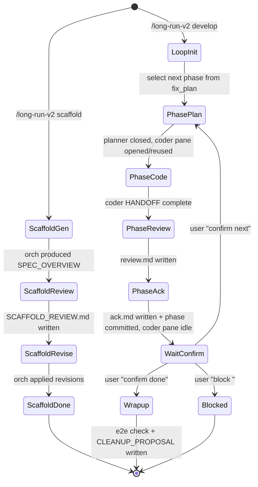

# long-run v2 — multi-agent orchestrated long-task workflow

Status: spec draft (2026-05-29)
Author: 郎振宁 (with assistant)
Replaces: nothing yet — `/dev-long-loop` and `/dev-long-task-scaffold` remain available.

## TL;DR

把现有 `/dev-long-loop`（单 agent 跨多轮）升级为 6 角色协作流：

1. 用户在普通对话中产出 `REQUIREMENT.md`
2. **scaffold orchestrator** 调 `/think-map /think-research`，搭工作区并与 **orchestrator reviewer** 单轮对齐
3. **loop orchestrator** 进入开发循环：每 phase 调用 **phase planner** 增强 → **phase coder**（tmux pane 长驻）实现 → **phase reviewer** 单轮分级 review → coder 自判 ack → 等用户 `confirm next` → 下一 phase
4. 收尾阶段做端到端验收 + 删除/沉淀建议

工作区文件是 SSOT，YAML 配置驱动 agent×model×thinking 映射，复用 `long_loop.py` 的 workspace 模板与 tmux 启动，全部 LLM 调度脑迁出 python。

## 已锁定

| # | 决策 |
|---|---|
| L1 | 6 角色，2 个 orchestrator（scaffold + loop）不合并 |
| L2 | 控制面构建：scaffold orch ↔ reviewer 两段；orch 自吃意见改 |
| L3 | phase reviewer 单一 agent，一轮分级输出（blocker/should/nit + refactor 维度），写入 `phases/<id>/review.md` 单文件 |
| L4 | review 循环：一轮 reviewer + 一轮 coder ack/修复 = 收口（不震荡） |
| L5 | 仲裁：coder 自判同意/不同意 + 阐述理由，loop orch 采信，不强制覆盖 |
| L6 | phase coder 跨 phase 持久化：tmux pane 长驻 + pane_id 写 `SESSIONS.md` |
| L7 | phase 间承接：loop orch 进入交互等待状态，用户在 orch pane 输入 `confirm next` / `confirm done` / `block <reason>` |
| L8 | 配置文件格式：YAML |
| L9 | 旧资产：复用 `long_loop.py` 的 `plan` / `launch-worker` / `observe`；新增 `kilo` agent backend 与 `--role` 参数；替换 loop 控制脑 |
| L10 | claude reviewer 走独立 claude CLI（不经 kilo），YAML 里 `cmd` 字段接受任意 shell 命令字符串，由 tmux send-keys 注入到 pane（zsh 交互模式展开 alias / env export） |
| L11 | 需求文档 D6：用户先在任意位置写 `REQUIREMENT.md`，scaffold 启动时 mv 进工作区根 |
| L12 | 删除过时文档 D5：放在收尾阶段，只输出 `CLEANUP_PROPOSAL.md` 建议清单，由人确认 |
| L13 | cliproxy 模型：所有 cliproxy gpt 模型已统一支持 `--variant low/medium/high/xhigh/max`（见 prerequisites）。后端只接受 4 档 `low/medium/high/xhigh`，`max` 是 install_hooks 侧 clamp 到 `xhigh` 的别名（实测：字面 `max` 后端返回 400），无独立第 5 档 |
| L14 | 每 phase ack 收口后、`wait_confirm` 前，phase coder 必须把该 phase 改动 commit 到 worktree 的专用分支（L16；git 仓库即 phase 边界 SSOT；未 commit 不算 phase 完成；不 push） |
| L15 | 收尾（wrapup）阶段除产出 `CLEANUP_PROPOSAL.md` 外，loop orch 还要整体扫一遍 `BACKLOG.md`，标出"可快速收敛"项供用户决定是否顺手清掉（仍是建议，不自动做） |
| L16 | 整个任务在独立 git worktree + 专用分支上开发，**绝不在 `main` 上开发或 commit**。`lr2.py scaffold` 创建 worktree（如 `../<repo>-lr2-<slug>`）+ 分支（如 `lr2/<slug>`）；phase coder 的 cwd = worktree；所有 L14 phase commit 落在该分支；合并/PR 由用户在 phase 间或收尾自行决定（不自动 push/merge） |
| L17 | （实测知识，2026-05-29）effort 档位事实：**claude `--effort`** 5 档 `low/medium/high/xhigh/max`（max 真档）；**cliproxy gpt** 仅 4 档，install_hooks 已把 `max` clamp 成 `xhigh`。注：被 L19 取代——TUI 不注入 variant，本条仅作背景知识保留，不再有 launcher 转换逻辑 |
| L18 | 控制工作区放 main checkout 的 `.long-loop/<date>_<slug>/`，用 `.git/info/exclude` 本地忽略（不改 tracked `.gitignore`），与 worktree 生命周期解耦（详见 Workspace 目录结构） |
| L19 | 思考等级：所有 TUI 长驻 pane（claude reviewer + kilo coder/orch/planner）**用各自 CLI/模型的默认 effort，不按 role 注入 variant**（用户决策 2026-05-29）。YAML 的 `variant` 字段降级为意图标注（仅做 enum 校验，不驱动 launch）；消解 TBD-5（kilo TUI 无 `--variant` flag 不再是问题）。默认值：claude Opus 默认 high；kilo 模型用 install_hooks 的 per-model 默认（gpt-5.5=medium / gpt-5.5-fast=low）|

## 待决策

| # | 决策点 | 推荐 |
|---|---|---|
| ~~TBD-1~~ 已定 | spec 是否额外生成 HTML companion artifact | 不生成；待超过单文件再触发 `/readable-html-artifact` |
| ~~TBD-2~~ 已定 | workspace 根目录路径 | 复用 `.long-loop/<date>_<slug>/`，避免双套并存 |
| ~~TBD-3~~ 已定 | `lr2.py` 形态 | sibling 独立文件（`skills/long-run-v2/lr2.py`），不污染 `long_loop.py` 旧路径 |
| ~~TBD-4 (S3)~~ 已解 | claude_cli `variant`→claude CLI 参数映射 | 实测解决，见 L17（variant→effort 按 backend 分流） |

| ~~TBD-5~~ 已定 | kilo TUI 长驻 pane 如何接收 per-role variant | 用户决策(2026-05-29)：**不管思考等级，TUI 一律用默认**。见 L19，TBD-5 消解 |

全部 TBD 收口。

## 可自由裁量

- tmux pane title 命名细节（满足跨重启可识别即可）
- HANDOFF.md 字段排序
- review.md 内部小节标题措辞
- prompt 文件分行风格

## 边界

### Goals
- 把多 agent 编排从 agent 内部脑补迁到 YAML + 文件 SSOT
- 让 phase coder 跨 orchestrator 重启复用 pane，避免 ramp-up 浪费
- review 维度合并到一次分级输出，省 1 个 reviewer pane
- 给用户 phase 间介入点（合 PR、人工验收、调线上）

### Non-goals
- 不做完全无人值守的全自动闭环
- 不做模型自动选型/调度
- 不做并发多 phase（仍是单 coder pane 串行推进）
- 不做远端调度

### Constraints
- 必须只依赖 tmux + 本地文件运行
- 必须兼容 kilo（新增）+ droid + claude 三种 agent backend
- 不自动 push / deploy / 改 secrets / 触第三方副作用
- 不在 `main` 上开发或 commit；全程在独立 worktree + 分支（L16）
- 工作区文件是 SSOT；agent 内存不可信

## Prerequisites（已就绪）

- cliproxy gpt 模型统一 variants（`scripts/install_hooks.py` 已改，2026-05-29）
  - `cliproxy/gpt-5.5-fast`：default=low + 5 variants（fast 是 id→`gpt-5.5` 的别名，仅 default effort 不同）
  - `cliproxy/gpt-5.5`：default=medium + 5 variants
  - `cliproxy/gpt-5.4 / 5.4-mini / 5.3-codex`：补齐 variants 和 default effort
- `~/.config/kilo/kilo.json` 重跑 install_hooks 不会丢 variants（实测 `--check=ok`，`current==desired`）
- variant→reasoning 生效已对照验证（2026-05-29，直连 cliproxy `/v1/chat/completions`，gpt-5.5，同一推理题）：

  | reasoning_effort | reasoning_tokens | 后端 |
  |---|---|---|
  | low | 32 | accept |
  | medium | 55 | accept |
  | high | 63 | accept |
  | xhigh | 253 | accept |
  | max | — | **400 拒绝**：`level "max" not supported, valid levels: low, medium, high, xhigh` |

  - reasoning token 单调递增，确认 `--variant` 切换确实改变推理深度（不再是"链路通但档位未验证"）。
  - 后端真实档位只有 4 个；`variant: max` 经 install_hooks clamp 成 `xhigh` 才不会 400。**spec 中任何 `variant: max` 与 `variant: xhigh` 行为等价，没有更高一档。**

## 场景化推演

### 场景 1：3-phase 合规改造（典型路径）

| 维度 | 内容 |
|---|---|
| Actor | 用户在已有项目根，3 phase（数据脱敏 / 日志审计 / 接口鉴权） |
| Step | (1) 用户与某 agent 讨论需求 → 产出 `~/scratch/REQUIREMENT.md` |
| | (2) 用户跑 `/long-run-v2 scaffold --requirement ~/scratch/REQUIREMENT.md` |
| | (3) `lr2.py scaffold` 建 worktree `../<repo>-lr2-compliance` + 分支 `lr2/20260529-compliance`（L16）→ mv `REQUIREMENT.md` 进 `.long-loop/20260529-compliance/` → state.json 记 worktree_path + branch |
| | (4) scaffold orch (kilo + cliproxy/gpt-5.5 + xhigh) 启动 → 调 `/think-map /think-research` → 产 `SPEC_OVERVIEW.md` `fix_plan.md` `phases/*/spec.md` |
| | (5) scaffold orch 调 launcher 开 reviewer pane (claude cli + opus 4.7 + max) → reviewer 写 `SCAFFOLD_REVIEW.md` → reviewer pane 关闭 |
| | (6) scaffold orch 读 review 自改工作区 → 关 scaffold orch pane |
| | (7) 用户跑 `/long-run-v2 develop` → loop orch (kilo + cliproxy/gpt-5.5-fast + low) 启动 |
| | (8) loop orch 读 fix_plan，选 phase 01 → 开 planner pane (kilo + cliproxy/gpt-5.5 + xhigh) → planner 增强 `phases/01/{research,plan,qa}.md` → 关 planner |
| | (9) loop orch 开 phase coder pane (kilo + cliproxy/gpt-5.5 + high)，cwd = worktree（L16）→ coder 实现 phase 01 → 写 HANDOFF + 不退出 pane |
| | (10) loop orch 开 reviewer pane → reviewer 读 diff + spec 写 `phases/01/review.md`（debugger + refactor 两小节）→ 关 reviewer |
| | (11) loop orch send-keys review 内容到 coder pane → coder 写 `phases/01/ack.md` 逐项 ack → 修复同意项 → 更新 HANDOFF → **commit phase 01 改动（L14）** |
| | (12) loop orch 在自己 pane 内 prompt 用户：`Phase 01 complete. confirm next / confirm done / block <reason>?` |
| | (13) 用户跑测试、合 PR、上线、回 orch pane 敲 `confirm next` |
| | (14) phase 02 重复步骤 8-13，phase coder pane 复用（不重开） |
| | (15) `confirm done` 后 loop orch 跑端到端验收 → 整体扫 `BACKLOG.md` 标"可快速收敛"项（L15）→ 写 `CLEANUP_PROPOSAL.md` → 关闭所有 pane |
| Touchpoints | tmux server / 文件系统 workspace / git worktree + 分支 / kilo CLI / claude CLI |
| Failure paths | coder pane 死掉、reviewer blocker 全 reject、用户长时间不 confirm、context 爆 |
| Exposes | pane 存活检查、冲突 escalation、wait_confirm 可中断、coder pane compact 触发 |

### 场景 2：中途崩溃恢复

| 维度 | 内容 |
|---|---|
| Actor | phase 02 中 loop orch pane 被误关 |
| Step | (1) 用户跑 `/long-run-v2 resume --workspace <path>` |
| | (2) 新 loop orch 启动 → 读 `state.json`（含 worktree_path + branch，L16）→ `git -C <worktree> worktree list` 校验 worktree 在、分支对 → 读 `HANDOFF.md` + `phases/02/qa.md` + worktree 内 git status |
| | (3) 通过 `SESSIONS.md` 拿 phase coder pane_id → `tmux list-panes -F '#{pane_id}'` 验证 |
| | (4) 存活 → loop orch 直接 send-keys 续上 |
| | (5) 不存活 → loop orch 报告丢失，给用户两选项："重开 coder pane（fresh context，读 HANDOFF 续）" 或 "标 phase 02 failed 回退" |
| Exposes | SESSIONS.md 必须每次 pane 启停时落盘；pane 存活检查必须在 resume 前置；丢失场景必须有降级路径 |

## Workspace 目录结构

控制工作区（`.long-loop/<date>_<slug>/`，编排 SSOT）与**代码 worktree**（L16，phase coder 实际改代码、commit 的地方）是两个独立位置。控制工作区不放在 worktree 的分支里，避免编排文件污染 phase commit。

**控制工作区落点（已定，L18）**：放在 **main checkout 的 `.long-loop/<date>_<slug>/`**，理由：
- 与 worktree 生命周期解耦 —— worktree 被删/重建，控制状态仍在（支撑"worktree 丢失→按 branch 重建"恢复路径）。
- resume 命令在 main checkout 执行，直接找到 `.long-loop/`。
- 用 **`.git/info/exclude`（本地 ignore，不改 tracked `.gitignore`）** 排除 `.long-loop/`，避免污染目标 repo 的提交内容。
- coder pane cwd=worktree，orch 用绝对路径读写 main checkout 的 `.long-loop/`；两者不同 cwd 但路径绝对，互不干扰。

```text
.long-loop/<date>_<slug>/
├── config.yaml                 # 角色—模型—thinking 映射（新增）
├── REQUIREMENT.md              # 用户讨论后产出，scaffold 时 mv 进来（新增）
├── SPEC_OVERVIEW.md            # scaffold orch 产出（沿用）
├── SCAFFOLD_REVIEW.md          # scaffold reviewer 产出（新增）
├── ORCHESTRATOR.md             # loop orch 协议（v2 内容覆盖 v1 模板）
├── WORKER_PROMPT.md            # phase coder 协议（v2 内容覆盖 v1 模板）
├── HANDOFF.md                  # phase coder 最新交接（沿用）
├── SESSIONS.md                 # tmux pane 注册表（新增）
├── fix_plan.md                 # phase 清单（沿用）
├── qa.md                       # 端到端验收（沿用）
├── logs.md                     # append-only（沿用）
├── state.json                  # harness 状态（沿用，扩字段）
├── BACKLOG.md                  # 非阻塞 + 高成本未做项 / disputed 项（新增）
├── CLEANUP_PROPOSAL.md         # 收尾阶段的删除/沉淀清单（新增）
└── phases/
    └── 01_<phase>/
        ├── research.md         # planner 增强
        ├── spec.md             # scaffold 初稿，planner 增强
        ├── plan.md             # planner 增强
        ├── qa.md               # planner 增强
        ├── review.md           # reviewer 分级输出（新增，单文件，内分 debugger / refactor）
        └── ack.md              # coder 对 review 的逐项 ack（新增）
```

## YAML schema

`config.yaml` 由 `lr2.py scaffold` 用模板生成，用户可手工编辑。

```yaml
version: 2

roles:
  scaffold_orchestrator:
    backend: kilo                # kilo | claude_cli | droid | custom
    model: cliproxy/gpt-5.5
    variant: xhigh               # 直接对应 kilo run --variant
    autonomy: medium             # off | low | medium | high

  scaffold_reviewer:
    backend: claude_cli
    cmd: 'export CLAUDE_CODE_OAUTH_TOKEN=$CLAUDE_CODE_OAUTH_TOKEN && claude --dangerously-skip-permissions'
    # 也可以写 alias 名: cmd: claude-max
    model: claude-opus-4-7       # 由 cmd 决定怎么传(--model);不传则用 CLI 默认(实测 Opus 4.8)
    variant: max                 # L19: 仅意图标注, 不注入; reviewer 用 claude 默认 effort(Opus 默认 high)
    autonomy: off                # 只读

  loop_orchestrator:
    backend: kilo
    model: cliproxy/gpt-5.5-fast
    variant: low                 # fast 本身就是 low effort,正好轻调度
    autonomy: medium

  phase_planner:
    backend: kilo
    model: cliproxy/gpt-5.5
    variant: xhigh
    autonomy: low                # 只写 phase plan 文件,不动代码

  phase_coder:
    backend: kilo
    model: cliproxy/gpt-5.5
    variant: high
    autonomy: high

  phase_reviewer:
    backend: claude_cli
    cmd: 'export CLAUDE_CODE_OAUTH_TOKEN=$CLAUDE_CODE_OAUTH_TOKEN && claude --dangerously-skip-permissions'
    model: claude-opus-4-7
    variant: max                 # L19: 仅意图标注, 不注入, 用默认 effort
    autonomy: off

policy:
  review_loop: one_round_with_ack    # L4 决策:一轮 review + 一轮 coder ack 收口
  arbitration: coder_self_judge      # L5 决策
  thinkmap_thinkresearch: evaluate   # planner/scaffold orch 自评估,不强制
  cleanup_strategy: propose_only     # L12 决策
  pause_between_phases: true         # L7 决策
  commit_per_phase: true             # L14:每 phase ack 收口后、wait_confirm 前,coder 必须 commit 该 phase 改动
  wrapup_backlog_triage: true        # L15:收尾阶段整体扫 BACKLOG,标出可快速收敛项

tmux:
  default_split: split-right         # phase coder 主 pane
  reviewer_split: split-down         # reviewer 临时 pane
  pane_title_prefix: lr2
```

## 角色 Prompt 骨架

每角色独立 prompt 文件，放 `skills/long-run-v2/prompts/<role>.md`。

| 角色 | 必读输入 | 必写产出 | 关键约束 |
|---|---|---|---|
| scaffold orchestrator | `REQUIREMENT.md`、repo 代码 | `SPEC_OVERVIEW.md`、`fix_plan.md`、`phases/*/spec.md`、`qa.md` | 评估调 `/think-map /think-research`；不写代码；读 `SCAFFOLD_REVIEW.md` 做自修订 |
| scaffold reviewer | `REQUIREMENT.md`、`SPEC_OVERVIEW.md`、`fix_plan.md`、`phases/*/spec.md` | `SCAFFOLD_REVIEW.md` | 只读；分 blocker/should/nit；focus 完整性、phase 拆分合理性、验收可执行性 |
| loop orchestrator | `SPEC_OVERVIEW.md`、`fix_plan.md`、`HANDOFF.md`、`logs.md`、`SESSIONS.md`、git status | `logs.md` append、`SESSIONS.md` 更新、状态转移决策 | 不写代码；不跑测试；只判断"开/关哪个角色 pane"和 wait_confirm 切换；**检测 coder 完成靠轮询 HANDOFF/done-marker 文件 mtime，不抓屏判断**（spike 已证抓屏不可靠）|
| phase planner | `SPEC_OVERVIEW.md`、`phases/<id>/spec.md`、repo 代码 | `phases/<id>/research.md`、`plan.md`、`qa.md` 增强 | 评估是否需要 `/think-map /think-research`；不写代码 |
| phase coder | `phases/<id>/{spec,plan,qa,research}.md`、`WORKER_PROMPT.md`、`HANDOFF.md`、`review.md`（如已存在） | 代码、**phase 收口 commit（L14）**、`HANDOFF.md`、`fix_plan.md` 状态、`phases/<id>/qa.md` evidence、`ack.md`（收到 review 后） | 完成 phase 前不退出 pane；不自动跨 phase；ack 收口后 commit 本 phase 改动（commit 不 push/deploy）；接收 review 后写 ack.md 逐项响应 |
| phase reviewer | `phases/<id>/{spec,plan,qa}.md`、git diff、`HANDOFF.md` | `phases/<id>/review.md`（含 `## Debugger` 和 `## Refactor` 两节，每项标 `[blocker/should/nit]`） | 只读；不动代码；不执行命令；每项给文件:行号 + 证据 |

## 状态机



## tmux pane / session 持久化协议

**Pane title 格式**：`lr2:<workspace-slug>:<role>:<phase-id>`

例：`lr2:20260529-compliance:coder:01`、`lr2:20260529-compliance:reviewer:02`

**SESSIONS.md 是 markdown 表，机器和人都能读**：

```markdown
# Sessions

| role | phase | pane_id | started_at | last_seen | status |
|---|---|---|---|---|---|
| phase_coder | 01 | %42 | 2026-05-29T10:00:00Z | 2026-05-29T10:45:00Z | running |
| phase_reviewer | 01 | %43 | 2026-05-29T10:50:00Z | 2026-05-29T10:55:00Z | closed |
```

**生命周期规则**：

| 角色 | 何时开 | 何时关 | 跨 phase |
|---|---|---|---|
| scaffold orch | scaffold 阶段开始 | scaffold done | 不跨 |
| scaffold reviewer | scaffold orch 调用 | review.md 写完 | 不跨 |
| loop orch | develop 阶段开始 | 收尾结束 | 跨整个 develop |
| phase planner | 每 phase 开始 | plan.md 增强完 | 不跨 phase |
| **phase coder** | phase 01 开始 | develop 结束 / 显式 compact | **跨所有 phase** |
| phase reviewer | coder HANDOFF 完成后 | review.md 写完 | 不跨 phase |

**Resume 协议**：
1. 读 `SESSIONS.md` 拿 pane_id
2. `tmux list-panes -aF '#{pane_id}' | grep <pane_id>` 验证
3. 存活 → loop orch send-keys 续上
4. 不存活 → 报告丢失，提供"重开（fresh context 读 HANDOFF）/ 标 phase failed"两选项

## 旧资产边界

| `long_loop.py` 现有能力 | v2 处置 |
|---|---|
| `plan` 子命令 | **复用**。`lr2.py scaffold` 调它；新增 `--config <yaml>` 注入 v2 配置；额外生成 SCAFFOLD_REVIEW/SESSIONS/BACKLOG/CLEANUP_PROPOSAL 占位文件 |
| `launch-worker --agent {droid,claude,custom}` | **扩展**。新增 `kilo` enum；新增 `--role` 参数（让 launch 知道注入哪份 prompt）；新增 per-backend 启动握手：claude 启动后先消费 trust 对话框再发 prompt（spike 实证，见风险表），kilo 无此步；claude pane 用交互 zsh 以拿到 `.zshrc` 的 `CLAUDE_CODE_OAUTH_TOKEN` |
| `observe / status / tail` | **复用**。`observe` 新增展示 SESSIONS.md |
| `run`（legacy 单轮 LLM 调度） | **弃用**。v2 调度脑在 loop orch（LLM）里，不经 python |
| `state.json` | **复用**，扩字段：`{ phase: int, role_in_flight: str, last_pane_event, state: scaffold|develop|wait_confirm|wrapup|blocked, worktree_path: str, branch: str }`（L16，resume 时据此定位 worktree） |
| `ORCHESTRATOR.md` / `WORKER_PROMPT.md` 模板 | **覆盖**。v2 模板替换 v1 内容 |

**新增独立资产**（不动 `dev-long-loop`）：
- `skills/long-run-v2/SKILL.md`
- `skills/long-run-v2/prompts/{scaffold_orch,scaffold_reviewer,loop_orch,planner,coder,reviewer}.md`
- `skills/long-run-v2/lr2.py`（薄 wrapper，调下层 `long_loop.py` + 新 multi-pane 逻辑）
- `commands/long-run-v2/{scaffold,develop,resume}.md`

`dev-long-loop` 和 `dev-long-task-scaffold` 保留不动，避免破坏现有用户。

## 失败恢复路径

| 故障 | 检测 | 恢复 |
|---|---|---|
| loop orch pane 误关 | 用户手动发现 | `/long-run-v2 resume --workspace <path>` |
| phase coder pane 死掉 | resume 时 `tmux list-panes` 不见 | 报告丢失 → 用户选"重开 fresh + 读 HANDOFF 续" 或 "标 phase failed" |
| reviewer 全 blocker 被 coder reject | coder ack.md 全 reject | loop orch 不仲裁；写 BACKLOG.md `disputed` 项；escalate 给用户 |
| coder context 爆 | coder 自报 or HANDOFF 长度超阈值 | coder 写 "需 compact" 标记 → loop orch 关 pane → 开新 coder pane（fresh + 读 HANDOFF + phase 文件续） |
| kilo / claude CLI 调用失败 | `launch-worker` 返回非零 | 写 logs.md 失败块 → 暂停 → 通知用户检查 CLI |
| 用户 `confirm` 前断电 | resume 时检测 state.json = wait_confirm | 恢复后直接回到 wait_confirm 状态 |
| `REQUIREMENT.md` 不存在 | scaffold 启动前 check | 报错退出，不创建工作区 |
| worktree 被删/分支丢失 | resume 时 `git worktree list` 不见（L16） | 报告丢失 → 用户选"按 state.json 的 branch 重建 worktree（commit 历史还在）" 或 "中止" |
| scaffold 时 main 有未提交改动 | scaffold 建 worktree 前 check | 警告并让用户先处理；绝不在 main 上 stash/commit |

## 验证 / 验收策略

### Inner-loop verifier（实现期）
- `lr2.py scaffold --config config.yaml --goal <g> --requirement <path>` 生成完整 workspace，模板齐全
- `lr2.py launch --role planner --workspace <ws>` 在 tmux split 出正确 pane title
- `SESSIONS.md` 的 pane_id 与 `tmux list-panes` 一致
- 状态机所有合法迁移有对应入口；非法迁移被拒绝
- 配置 schema 校验：缺字段、错 enum、未知 backend 都被拒

### Acceptance verifier（用户目标）
- **跑通一个真实 3-phase 任务**（场景 1），全程产物可审阅
- review.md 的 blocker 项被 coder 至少考虑过（ack.md 有逐项响应）
- phase coder pane 在 phase 1 → phase 2 之间没被重开（除非显式 compact）
- 每个完成的 phase 在进入 wait_confirm 前都有对应 commit（`git log` 可见，L14）
- 用户能在 phase 间中断 / 合 PR / 再 `confirm next` 续上
- 全流程产物可被另一个人接手（不依赖 agent 内存）
- 收尾阶段产出的 CLEANUP_PROPOSAL.md 是建议，不是自动删除
- 收尾阶段在 CLEANUP_PROPOSAL.md 或 BACKLOG.md 中明确标出了"可快速收敛"项（L15）

### 剩余风险
- kilo backend `--variant` 档位生效已对照验证（见 Prerequisites 表，low→xhigh reasoning token 32→253 单调递增）。此项不再是风险。
- kilo TUI 长驻 + send-keys 两轮注入 + 跨轮 context 保留已验证（2026-05-29 spike，`/tmp/lr2_spike/spike2.log`）。最高风险 Premise 对 kilo 路径已解除。
- claude TUI 经交互 zsh pane + token + send-keys 注入已验证（2026-05-29 spike，`/tmp/lr2_spike/spike_claude.log`，ZEBRACLAUDE 真回复）。reviewer 路径架构风险解除。
- claude 启动 trust 对话框需 launcher 预消费（见风险表），否则首个 prompt 被吞 —— 工程细节，非架构风险
- multi-pane send-keys 在不同终端配置下可能行为不一致 [未验证]
- ~~kilo TUI 无 `--variant` flag~~ 已消解：用户决策 TUI 用默认思考等级（L19），不投递 variant，故无需 launch flag。`lr2.effort_for` 已移除（不再管理思考等级）
- loop orch 不得靠 capture-pane 抓屏判断 coder 完成（spike 证明抓屏判定不可靠），必须靠 HANDOFF/done-marker 文件
- 单轮 review 可能漏深层 bug，靠 acceptance verifier 兜底
- **[S4 已否决]** send-keys 注入 prompt 文本的命令注入面（REQUIREMENT/review 内容经 zsh 交互模式解释）：用户决策不在本期处理。残余风险 [未验证]：若 prompt 文本含反引号/`$()`/`;` 等，经 send-keys 进交互 shell 可能被执行；缓解依赖"workspace 文件由本人产出、不引入不可信外部输入"这一前提。实现 send-keys 时若条件允许，建议优先用 `tmux send-keys -l`（literal）降低暴露，但不作为本期硬门禁。

## Premise Collapse

**当前方案**（kilo 与 claude 两路径 a/b/c 均已 spike 验证，2026-05-29）：
`(a) 在已存在 tmux pane 内被 send-keys 注入新 prompt 并执行 ✅（kilo: PONG/ZEBRA；claude: ZEBRACLAUDE）; (b) cliproxy gpt --variant 切换生效 ✅（reasoning token 32→253）; (c) interactive 模式可被外部脚本启动并长驻 ✅（kilo 两轮 + context 27.1K 跨轮保留；claude 经交互 zsh + token 长驻）— 整套架构成立。`
`唯一附加工程约束：claude 启动需先消费 trust 对话框（见风险表）；不构成架构性塌方风险。备选（reviewer 改走 kilo 或一次性 process）保留但已非必需。`

**备选 A（合并两个 orchestrator）**：
`If 一个 orch context 同时承担 scaffold 和 loop 调度不会过载、不丢早期需求理解 — 备选成立。If does not hold，调度判断质量下降，长任务后期可能漂移到错误方向。`

**备选 B（不复用 long_loop.py，全新写）**：
`If 重写 workspace 模板和 tmux launcher 的收益大于 "并存两套用户认知负担" 的成本 — 备选成立。If does not hold，旧 skill 文档和新 skill 文档矛盾，用户不知道用哪个。`

推荐当前方案。备选 A 在用户当前已选 "拆 2 个 orch" 的前提下被排除；备选 B 需要等 v2 稳定后再评估是否吞并旧 skill。

## 风险与回退

| 风险 | 严重度 | 缓解 |
|---|---|---|
| ~~kilo 不支持 send-keys 续 prompt~~ | ~~高~~ → 已验证 | 2026-05-29 spike PASS（kilo TUI 长驻 + 两轮 send-keys + context 保留）|
| ~~claude CLI 不支持 send-keys/长驻（reviewer）~~ | ~~中~~ → 已验证 | 2026-05-29 spike PASS（交互 zsh pane + token + send-keys 注入 ZEBRACLAUDE 真回复）|
| claude 首次进 worktree 弹 trust 对话框吞掉首个 prompt | 中 | launcher 启动 claude 后先消费 trust 对话框（预发 Enter / 预信任 worktree），再发真 prompt；`--dangerously-skip-permissions` 不跳过它 |
| orch 抓屏误判 coder 完成 | 中 | 不抓屏；coder 写 HANDOFF/done-marker，orch 轮询文件 mtime（spike 已暴露抓屏假阳/假阴）|
| reviewer 单轮漏 bug | 中 | acceptance verifier 端到端兜底；BACKLOG 跟踪 |
| coder pane 越用 context 越脏 | 中 | 加 token / 时间阈值，触发 compact 重开 |
| 用户中断后忘记 resume | 低 | scaffold 完输出明显 resume 命令；SESSIONS.md 顶部贴 resume 指南 |
| 旧 `dev-long-loop` 用户被误改 | 低 | 完全不动旧 skill，全新独立 skill 和 command |
| claude CLI alias 中的 token 泄露 | 中 | YAML 里只允许引用 `$VAR`，不允许写 token 字面值；落盘前校验 |

**回退点**：v2 出问题时，`/dev-long-loop` 始终可用；删除 `skills/long-run-v2/` 和 `commands/long-run-v2/` 即可完全回退。因开发在独立 worktree + 分支（L16），`main` 始终干净；丢弃整个尝试 = 删 worktree + 删分支，main 无残留。

## 实施步骤（高层）

1. **Spike 验证（实现前必做，按风险从高到低排，高风险项先做）**
   - **[高风险，go/no-go] ✅ 已验证（2026-05-29，kilo）** kilo TUI 在 tmux pane 长驻 + 两次 `send-keys` 注入 prompt 均被执行（P1→PONG 8.8s，P2→ZEBRA 注入同一 pane，context 27.1K 跨轮保留）。证据：`/tmp/lr2_spike/spike2.log` capture-pane。整套 phase coder 跨 phase 复用架构的命门 → 成立。
   - **[衍生约束]** spike 自动抓屏判定出现过假阳性+假阴性，证明**靠 capture-pane 判断 "coder 是否完成" 不可靠**。loop orch 检测 coder 完成必须靠 coder 写 HANDOFF/done-marker 文件 + 轮询文件 mtime，**不得靠 pane 文本抓屏**。
   - **[高风险，go/no-go] ✅ 已验证（2026-05-29，claude）** claude TUI 经交互 zsh pane（source `.zshrc` 拿到 `CLAUDE_CODE_OAUTH_TOKEN`，TOKEN_PRESENT）启动 + 长驻 + send-keys 注入执行（P2→ZEBRACLAUDE 真回复 ~6s）。证据：`/tmp/lr2_spike/spike_claude.log`。
   - **[claude 启动握手，launcher 必须处理]** claude 首次进新目录弹 **trust-folder 对话框**（"Is this a project you trust?"），`--dangerously-skip-permissions` **不跳过**；首个 send-keys 会被对话框吞掉（spike 的 P1 即因此失败）。launcher 启动 claude 后必须先消费 trust 对话框（预发 Enter 选"Yes, I trust"，或预先把 worktree 加入 claude 信任列表），再发真 prompt。kilo 无此对话框 → launcher 需 per-backend 启动握手。
   - **[低风险，已验证] ✅** kilo run 跑 cliproxy 模型 + `--variant` 档位生效（2026-05-29，见 Prerequisites 对照表，reasoning token 单调递增）。
   - 三条 Premise 对 kilo 与 claude 两路径均已解除；剩余只是 launcher 的 per-backend 启动握手工程细节，非架构风险。
2. **新建 skill + commands**：`skills/long-run-v2/SKILL.md` 和 `commands/long-run-v2/{scaffold,develop,resume}.md`
3. **扩展 `long_loop.py`**：加 `kilo` agent enum + `--role` 参数，不动核心逻辑
4. **写 `lr2.py` wrapper**：3 个 subcommand（scaffold / develop / resume），调下层 `long_loop.py plan/launch-worker/observe` + 新 multi-pane 调度 + worktree/分支创建与校验（L16，coder pane cwd 指向 worktree）
5. **写 6 份 prompt 文件**：按角色矩阵和约束表
6. **TDD 关键路径**：SESSIONS.md 读写、pane 存活检查、状态机迁移、resume 路径
7. **跑场景 1 端到端**（真实 repo + 真实任务），acceptance 验收
8. **写 README / 更新 AGENTS.md skill 路由**

预估总工作量：1-2 周（含 spike + acceptance 验证）。

## 关联

- 参考：`skills/dev-long-loop/SKILL.md`、`skills/dev-long-task-scaffold/SKILL.md`
- Prerequisites：`scripts/install_hooks.py`（已改）+ `scripts/tests/test_install_hooks.py`（已加 variants 测试）
- Skill 路由：实施后在 `agents/AGENTS.md` 加 `/long-run-v2` 入口；与 `/dev-long-loop` 并存，按场景路由（小/中任务用 dev-long-loop，复杂多 phase 协作用 long-run-v2）
