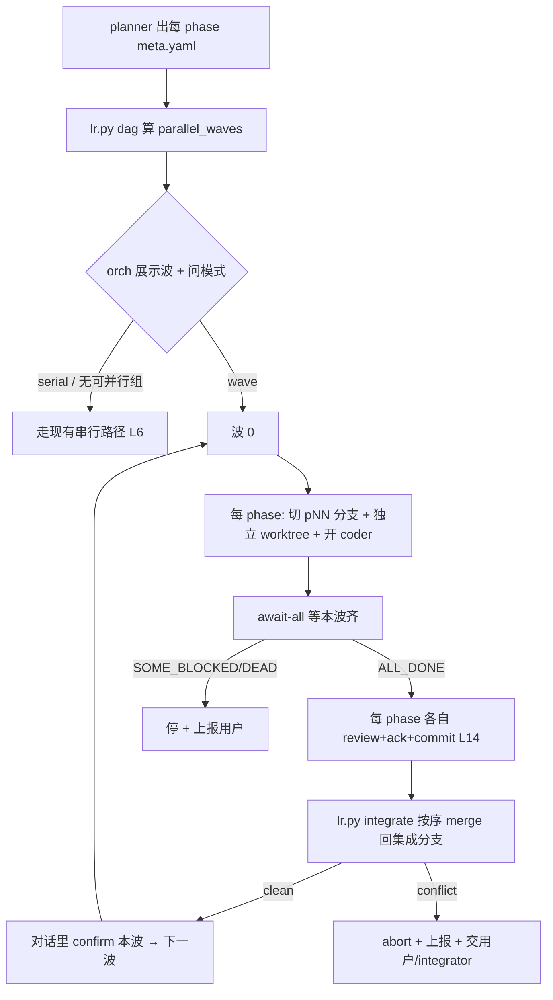

# dev-long-run · 并行能力 spec

> **状态:已搁置 / 未批准(2026-05-29)。** 用户决定先把 serial 流程跑稳再说,并行暂不做。
> 搁置理由(用户判断 + 设计分析一致):并行真正卡吞吐的是**人的 review/confirm 带宽**,不是 coder 墙钟;
> 在 serial 仍 v0 未端到端验收的地基上叠并行(集成冲突、半波恢复)会放大失控。
> 本文**不是当前实施计划**,是将来若重启并行时的设计底稿。L23–L26 为草案,**未锁进 overview.md**。
> overview.md:76 的 non-goal「不做并发多 phase」**仍然有效,未被取代**。
>
> 重启前提(任一):serial 已端到端验收稳定,且出现"多个独立 phase 值得同时跑、愿意批量 confirm"的真实场景。
>
> ---
>
> 方向 spec(草案)。父 spec: `overview.md`（L1–L22 已锁定约束）。
> 读者:本仓库维护者。先读 §1 TL;DR + §9 风险(尤其 review 带宽 premise collapse)+ §7 场景。

## 1. TL;DR

给 dev-long-run 加**多 phase 并行执行**,提升需求吞吐。三件事:

1. **planner 产出依赖 DAG** —— 每 phase 标 `depends_on`(逻辑依赖) + `touches`(碰的文件);两 phase 可并行 ⟺ 互不(传递)依赖 **且** touches 不重叠。
2. **调度模式 plan 时交互选** —— `serial`(现状) / `wave`(按 DAG 层并发,每波 confirm + 集成) / `rolling`(滚动并发到上限,末尾批量集成)。**默认 serial,绝不默认并行**(flagless-first,像 worktree new/in-place)。
3. **隔离策略 A** —— 每个并发 phase 一个独立 worktree + 分支,各自 commit;之后**集成(merge)回主开发分支**,冲突 stop + escalate,绝不静默解决。

**分阶段落地**(串行流程仍 v0,不一次全上):Phase 1 只出 DAG + 展示可并行组(执行仍串行)→ Phase 2 上 wave → Phase 3 上 rolling。

## 2. 已锁定(用户决策)

- 隔离 = A(worktree-per-parallel-phase + 集成合并)。
- 模式 = plan 时交互选,三档 serial/wave/rolling,默认 serial。
- planner 出 DAG:`depends_on` + `touches`。
- orchestrator(= 对话 agent)驱动:launch 多 coder pane(各自 worktree)、await-many、波/批 confirm。
- 复用现有:`await`(status 文件,L22)、worktree(L16)、逐 phase commit(L14)、不碰 main(L16)。
- 实现分阶段(Phase 1→2→3),不一次性全上。

## 3. 待决策(需用户拍板,不沉默选边)

| # | 决策点 | 候选 | 推荐 | 理由 |
|---|---|---|---|---|
| D-A | **集成机制** | (a) lr 先试 clean `git merge`,冲突才 escalate 给一个 integrator coder/用户;(b) 总是开 integrator coder 做全部 merge | **(a)** | 无冲突时纯机械、零 token;有冲突才上人/coder。符合 KISS + 故障导向 |
| D-B | **rolling 的 review 时机** | (a) 每 phase 完成即 review(同 serial),仅 merge 批量到末尾;(b) review 也批量到末尾 | **(a)** | review 本就 per-phase 独立(L3/L4),没必要攒;只有 merge 需要等齐 |
| D-C | **N 个并行 coder 的 pane 落点** | (a) 当前 tab 继续 split(L20),靠小 max_parallel(2–3) 控制不挤;(b) 每并行 coder 开新 tmux window | **(a) + max_parallel 默认 2** | 维持 L20「都在当前 tab」心智;window 会让用户来回切看不全。挤就靠限并发数 |
| D-D | **touches 粒度** | (a) 文件路径/glob;(b) 目录级 | **(a) 文件路径,planner 尽量精确;无法确定就留空** | 空 touches = fail-safe 当「碰所有文件」= 不可并行(见 L25) |

> D-A/B/C/D 不定不进入对应实现 phase。Phase 1(DAG-only)不依赖这四个,可先做。

## 4. 边界

### Goals
- planner 产出可机读的 phase DAG(`depends_on` + `touches`),并算出可并行组。
- 三种调度模式,plan 时交互选,默认 serial。
- wave/rolling 下并发 coder 各跑独立 worktree,集成 merge 回主分支,冲突可见可控。
- 全程复用并维持 L14(逐 phase commit)、L16(不碰 main)、L22(status-file await,禁 grep prose)。

### Non-goals
- 不做跨 phase 自动冲突「智能合并」——冲突一律 stop + 交人/coder。
- 不做动态重排 DAG / 自动拆分 phase —— DAG 由 planner 给,人可改。
- 不做无人值守全自动 —— 波/批之间仍 confirm(serial/wave),rolling 末尾仍 confirm。
- 不改 serial 现有行为(Phase 1 必须保证 serial 路径零回归)。
- 不自动 push/PR(同 L16,合并只到本地集成分支)。

### Constraints
- 反转 overview.md:76 的 non-goal;新增 L23–L26,旧 non-goal 标「被 L23–L26 取代」。
- 并行安全判定是**纯函数**(可 TDD):`parallel_waves(phases) -> list[list[id]]`。
- fail-safe:依赖未知 / touches 空 / DAG 有环 → 该 phase 不参与并行(退串行),不冒险。

## 5. 领域语言(新增)

**Phase DAG**:phase 间的有向无环依赖图。节点 = phase,边 = `depends_on`。
_Avoid_: 「阶段树」(不是树,是 DAG)。

**parallel-safe(可并行安全)**:两 phase 满足「互不传递依赖」**且**「touches 交集为空」。
_Avoid_: 「独立 phase」(独立只说依赖,漏了文件重叠)。

**wave(波)**:DAG 拓扑分层后的一层;同一波内的 parallel-safe phase 并发执行。

**integration branch(集成分支)**:主开发分支 `lr/<slug>`(L16 那条),并发 phase 的成果 merge 回这里。
**phase branch**:并发 phase 各自的 `lr/<slug>/p<NN>`,从集成分支当前 tip 切出。

**integrate(集成)**:把若干 phase branch 按确定顺序 merge 回集成分支的动作;冲突即 stop。

## 6. 新增锁定约束(拟追加到 overview.md)

| ID | 约束 |
|---|---|
| L23 | **调度模式 = plan 时交互选**(serial/wave/rolling + rolling 的 max_parallel)。flagless-first:planner 出 DAG 后,orchestrator 展示可并行组并问用户选哪个模式,**未选不进入并行执行**;用户只说「继续」时**默认 serial**,绝不默认并行。 |
| L24 | **并行隔离 = A**。集成分支 = `lr/<slug>`(L16 主分支);每并发 phase 切 `lr/<slug>/p<NN>`(从集成分支当波 tip),独立 worktree(`../<repo>-lr-<slug>-p<NN>`),coder cwd = 该 worktree,phase commit(L14)落 phase branch。波/批末尾 `integrate` 按 phase-id 升序 merge 回集成分支。**merge 冲突 → `git merge --abort` + 标记 + 上报,绝不静默解决**(交用户或 integrator coder,见 D-A)。仍不 push(L16)。 |
| L25 | **parallel-safe 判定 = 无传递依赖 且 touches 不重叠**。纯函数 `parallel_waves`。**fail-safe**:phase 的 touches 为空/未知、DAG 含环、或依赖解析失败 → 该 phase 标不可并行,退串行,不冒险并发。 |
| L26 | **await-many**:`lr.py await-all` 接收 N 组 `(status,pane)`,每轮轮询全部 status token + 查每个 pane 死活 + 有界超时;聚合退出码(`ALL_DONE`/`SOME_BLOCKED`/`SOME_DEAD`/`TIMEOUT`/`SOME_COMPACT`)。**沿用 L22 纪律:禁 grep prose、禁抓屏**。 |

## 7. 场景化推演

| Scenario | Actor / Context | Step-by-step path | System touchpoints | Exposed issue | Requirement / Contract |
|---|---|---|---|---|---|
| **S1 wave happy path** [推断] | 对话 agent(orch);任务有 3 phase:01 改 `schema.go`(契约);02 改 `a.go`、03 改 `b.go`,都 `depends_on:[01]`,touches 互斥 | planner 出 DAG → orch 展示「波0=[01], 波1=[02,03]并行」→ 用户选 wave → 波0 串行跑 01,commit 到 `lr/<slug>/p01`,integrate 回 `lr/<slug>` → 波1:切 `…/p02`+`…/p03`(都从含 01 的集成 tip),两 worktree 两 coder 并发 → `await-all` 等齐 → 各自 commit → integrate 按序 merge 02、03 回集成分支(clean) → confirm | `parallel_waves`、worktree fan-out、`await-all`、`integrate`、`git merge`、tmux 双 pane | (1) phase branch 必须从**集成 01 之后**的 tip 切,否则 02/03 看不到 01 的契约 (2) integrate 顺序要确定(id 升序) | L24(切 tip 时机 + 顺序)、L26(await-all)、acceptance:`git log lr/<slug>` 见 01/02/03 三个 commit,02/03 各在自己 worktree 并发产生 |
| **S2 touches 漏报 → 集成冲突** [推断] | 同上,但 02、03 都偷偷改了 `go.mod`(planner 没申报这个共享文件) | 波1 两 coder 各自 worktree 改 `go.mod`(互不可见,**不直接冲突**) → 各自 commit → integrate merge 02 clean → merge 03 在 `go.mod` 冲突 → lr `git merge --abort` + 标 03 conflicting + 上报 orch → orch 告诉用户「03 集成冲突于 go.mod」+ 给选项(开 integrator coder 解 / 用户手解) | `integrate` 冲突分支、`git merge --abort`、上报路径 | touches 是 planner 的**断言,可能错**;靠 touches 判并行不是万无一失 —— **隔离 A 是真正兜底**:错了也只在 merge 暴露,不静默损坏代码 | L24(冲突 stop+escalate)、L25(touches 不可信时的 fail-safe 价值)、acceptance:制造 touches 漏报,验证 integrate 报冲突且不静默 merge |
| **S3 几乎全链式依赖** [推断] | 任务 5 phase,02 依赖 01、03 依赖 02…全链 | planner DAG 每波只有 1 个 phase → `parallel_waves` 退化成 5 个单元素波 → orch 展示「无可并行组」→ 即使选 wave,行为 == serial(只是多了 per-phase 切 worktree 开销) | `parallel_waves`、退化检测 | 并行对链式任务零收益、纯增开销 → orch 应在「无可并行组」时**提示用户 serial 更划算** | orch 展示逻辑:可并行组为空时显式建议 serial(不强迫 wave) |

## 8. 数据结构与接口(契约,不写实现)

### planner 输出(扩 `phases/<id>/spec.md` 或新 `phases/<id>/meta.yaml`)
```yaml
# phases/<id>/meta.yaml  (planner 写, 机读)
id: "02"
depends_on: ["01"]          # 逻辑依赖的 phase id 列表
touches:                     # 该 phase 预计修改的文件 (路径或 glob); 空 = fail-safe 不可并行
  - "internal/a.go"
  - "internal/a_test.go"
```
> 放独立 `meta.yaml` 而非塞进 `spec.md`,便于机读、避免解析 prose(同 L22 思路:机读信号独立成文件)。

### 纯函数(Phase 1 的 TDD 核心,lr.py 新增)
```python
def parse_phase_dag(metas: list[dict]) -> dict
#   入: 各 phase 的 {id, depends_on, touches}
#   出: {"nodes": {...}, "edges": [...], "errors": [环/悬空依赖]}

def parallel_waves(dag: dict) -> list[list[str]]
#   出: 拓扑分层后, 每层内再按 touches-disjoint 切成 parallel-safe 组
#       [["01"], ["02","03"], ["04"]]  ← 波内多元素 = 可并发
#   fail-safe: touches 空/未知/有环的 phase 单独成波 (退串行)

def render_waves(waves: list[list[str]]) -> str
#   出: 给用户看的人话表 (哪些波能并行 / 哪些只能串)
```

### CLI(分阶段新增)
```
# Phase 1
lr.py dag --workspace <ws>          # 读各 phases/*/meta.yaml, 打印 parallel_waves 人话表

# Phase 2/3
lr.py launch --role phase_coder --phase NN --parallel-branch lr/<slug>/pNN
                                     # 切 phase branch + 独立 worktree + 开 coder
lr.py await-all --status f1 --pane p1 --status f2 --pane p2 ...   # L26 聚合等待
lr.py integrate --workspace <ws> --branches lr/<slug>/p02 lr/<slug>/p03
                                     # 按序 clean-merge 回集成分支; 冲突 abort+报告(退出码区分)
```

### 调度流程(orchestrator playbook,wave 模式)


## 9. 风险与验证

### Premise collapse
- **If** 真实任务里 parallel-safe phase 占比可观(不是几乎全链式),**则** wave/rolling 提升吞吐成立。**If does not hold**(几乎全链式依赖),并行退化为串行 + 多 worktree 开销,**纯负担、吞吐零提升** → 缓解:S3 的「无可并行组时 orch 建议 serial」,把这条假设崩溃显式化给用户。
- **If** planner 的 touches 申报准确,**则** 靠 touches-disjoint 判并行安全可靠。**If does not hold**(漏报共享文件),并发 coder 在**各自 worktree**改同一文件 → **隔离 A 下不直接冲突,推迟到 integrate merge 才暴露**(stop+escalate,不静默损坏)→ 这正是选 A 而非 B(单 worktree 文件互斥)的核心理由:A 把「假设错了」从「代码损坏」降级成「合并冲突」。

### 最大风险
1. **集成 merge 冲突频发**(touches 估不准)→ 缓解:L24 stop+escalate + D-A 的 integrator coder;Phase 2 验收专门压一个 touches 漏报场景(S2)。
2. **serial 回归**(加并行碰坏现有串行)→ 缓解:Phase 1 不动执行路径只加 DAG;现有 `test_lr.py` 全绿是 Phase 1 的硬门。
3. **token 成本随并发翻倍** → 缓解:max_parallel 默认 2(D-C);orch 在选 wave/rolling 时如实告知用户「会同时跑 N 个 coder」。
4. **pane 拥挤**(N coder split 当前 tab)→ D-C:小 max_parallel + 维持 L20。

### 验证(分 inner-loop / acceptance)
- **inner-loop verifier**(每 phase TDD):`parse_phase_dag` / `parallel_waves` / `render_waves` 纯函数单测(含环、悬空依赖、空 touches、touches 重叠、全链式退化);`integrate` 的 clean/conflict 分支用临时 git 仓库测;`await-all` 聚合退出码用 fake status 文件测。
- **acceptance verifier**(端到端,光单测不算完成):
  - Phase 1:跑一个真实 ≥3-phase plan,`lr.py dag` 输出的 parallel_waves 与人工判断一致;serial run 行为零变化(`test_lr.py` 全绿 + 真跑一遍 serial)。
  - Phase 2:造一个「2 个 parallel-safe phase」真实任务,wave 模式下**两个 coder 真的在两个 worktree 并发**(`git -C` 两 worktree 各有 in-flight 改动)、各自 commit、`integrate` clean-merge 回集成分支、`git log lr/<slug>` 见全部 commit;再造 S2 漏报场景验证 integrate 报冲突不静默。
  - Phase 3:N > max_parallel 的独立 phase,验证并发被 cap、全部最终 merge。

### 回退点
- Phase 1 纯加法(DAG 展示),删 `dag` 子命令 + `meta.yaml` 读取即回退,serial 不受影响。
- Phase 2/3 出问题:config 选 serial 即绕开全部并行路径;删 `await-all`/`integrate`/`--parallel-branch` 回到 v0 串行。
- 集成分支永远是本地分支,不 push,丢弃 = 删 phase branch + worktree,主 `lr/<slug>` 可重建。

## 10. 分阶段实施(只展开到可执行 + 可验证)

> 每个 sub-phase 走 `/dev-tdd`(纯函数先 RED→GREEN),完成进 `/guard-verify` 给 acceptance 证据。先做 Phase 1,验收过再开 Phase 2。

### Phase 1 — DAG-only,执行仍串行(不依赖 D-A/B/C/D)
1. `skills/dev-long-run/prompts/phase_planner.md` — 加产出 `phases/<id>/meta.yaml`(depends_on + touches)的指令 — 验证:planner pane 跑完后 meta.yaml 存在且字段合法。
2. `skills/dev-long-run/lr.py` — 新增 `parse_phase_dag` / `parallel_waves` / `render_waves` 纯函数 + `dag` 子命令 — 验证:`test_lr.py` 新增用例(环/悬空/空touches/重叠/全链式)RED→GREEN。
3. `skills/dev-long-run/SKILL.md` + `prompts/loop_orchestrator.md` — 加「planner 后跑 `lr.py dag`、展示波、问模式(默认 serial)」playbook;无可并行组时建议 serial(S3)— 验证:真实 ≥3-phase 任务人工核对 dag 输出。
4. `docs/specs/dev-long-run/overview.md` — 追加 L23–L26、标 non-goal:76 被取代 — 验证:`verify_skills.py` 通过。

### Phase 2 — wave(依赖 D-A/B/C/D 已定)
1. `lr.py` — `launch --parallel-branch`(切 phase branch + 独立 worktree,扩 `plan_worktree`/`worktree_path`/`branch_name` 支持 `-p<NN>` 后缀)— 验证:临时 git 仓库测多 worktree 创建 + branch base。
2. `lr.py` — `await-all`(扩 `cmd_await` 多 (status,pane) + 聚合退出码,L26)— 验证:fake status 文件 + fake pane-alive 测聚合码。
3. `lr.py` — `integrate`(按序 clean-merge,冲突 abort+退出码,L24)— 验证:临时 git 仓库测 clean + conflict 两分支。
4. `prompts/loop_orchestrator.md` — wave 调度循环(图 §8):fan-out → await-all → per-phase review/ack/commit → integrate → 波间 confirm — 验证:S1 端到端。
5. acceptance:S1 + S2 真实跑。

### Phase 3 — rolling(依赖 Phase 2)
1. `lr.py` — rolling 调度:`parallel_waves` 之上做「依赖一清即启、并发 cap max_parallel」的滚动发射 — 验证:纯函数测滚动发射序列受 cap 约束。
2. `prompts/loop_orchestrator.md` — rolling playbook:per-phase review(D-B) + 末尾批量 integrate + 末尾 confirm — 验证:N>max_parallel 端到端,并发被 cap。

## 11. 自审

- [x] 读者(本仓库维护者)、产物(parallel.md spec + 拟追加 L23–L26)、最小可验收(Phase 1 dag 子命令 + 纯函数单测)明确
- [x] 已锁定 / 待决策(D-A..D) / 可自由裁量 区分
- [x] 3 个场景压测(S1 happy / S2 失败路径 / S3 退化)
- [x] 无 TBD 占位(D-A..D 是显式待决策,非占位)
- [x] 每步有文件路径 + 验证方式
- [x] 排除项(Non-goals)显式
- [x] DAG 无环由 `parse_phase_dag` 的 errors + fail-safe 保证
- [x] 垂直切片:Phase 1/2/3 各自端到端可验收,不是按技术层切
- [x] Mermaid 图(§8 wave 流程)
- [x] premise collapse ≥1(给了 2 条)
- [x] inner-loop / acceptance verifier 分离
