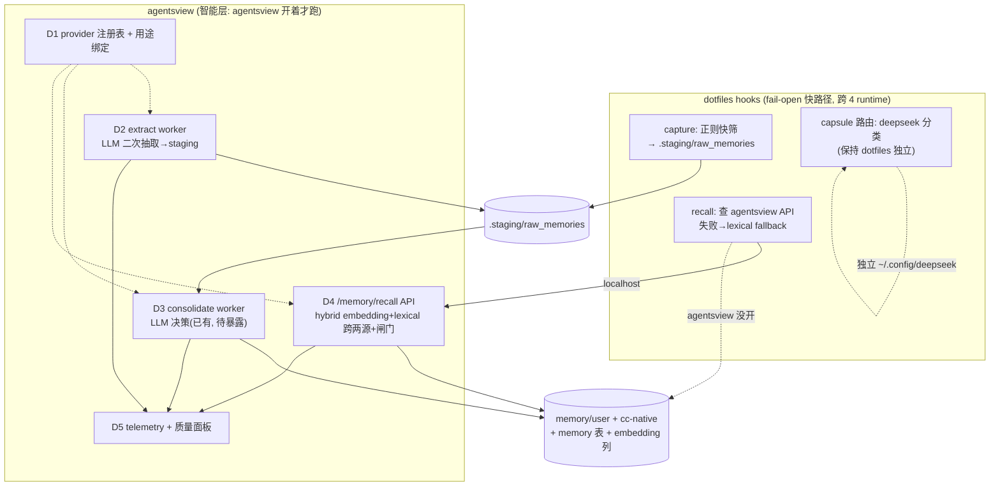

# Spec: Memory 质量层(从「能 working」到「working 得好」)

> 状态:待用户审批。SSOT。HTML companion 批准后另出。
> 关联:[[memory-vault-program]]、[[agentsview-memory-vault-viz-program]]、`docs/memory-vault-plan-2026-06-23.md`(上一阶段=管道)

## TL;DR

上一阶段(5-phase loop + private backup)搭的是**管道**:capture→staging→consolidate→memory→backup 能跑通。
本阶段是**质量层**:让每个环节的产出**质量可控、可度量、可调**。北极星 = 让这套记忆系统不止 working,而是 working 得好。

四件事收敛成**一个统一架构**:

> **agentsview = 智能层(LLM / embedding / 可观测 / 配置中枢);dotfiles hook = fail-open 快路径,agentsview 在就优先走它。**

推荐路径:**D1 配置解耦(地基)→ D2 LLM 抽取 → D4 召回质量 → D3 巩固暴露 → D5 可观测(质量的证明)**,分 5 phase,逐 phase 可独立交付回退。

## 已锁定(用户本轮决策)

1. **LLM 抽取放 agentsview 后台 worker**;hook 保留正则当 fail-open 快筛(不碰 hook 热路径延迟)
2. **完整 provider 注册表 + 用途绑定**(`[llm.providers]` + `[llm.usage]`);现有 `[llm]`/`[llm.embed]`/`[consolidate]` 向后兼容
3. **capsule 召回路由保持 dotfiles 独立**(hook-time 必须能独立运行,不并入 agentsview 配置)
4. **召回服务:hook 查 agentsview 本地 API,挂 lexical fallback**(agentsview 在→hybrid 语义召回;不在→退化 lexical)
5. **召回质量层 = hybrid(embedding 语义 + lexical)跨两源(cc-native + cross-agent)+ 相关性闸门**
6. **先写完整 spec 给用户过目**,批准后实现
7. redact-before-push 不做(沿用既定边界);memory 永不进 PUBLIC 仓库;capsule 独立运行不依赖 agentsview

## 边界

**Goals**
- 抽取召回率↑:正则只抓显式关键词 → 加 LLM 语义抽取(异步、可配)
- 召回准确率↑:lexical-only 且只读 cross-agent → hybrid 语义 + 跨两源 + 相关性闸门
- 配置可治理:5 处散落 LLM 配置 → provider 注册表 + 用途绑定,一处配账号多处复用
- 巩固可操作:已存在但藏在代码里的 `[consolidate]` 配置 → UI 暴露 + 写盘
- 质量可度量:抽取/巩固/召回/注入全程零 telemetry → 埋点 + agentsview 面板(否则「做了=没做」)

**Non-goals**
- 不引入独立向量数据库(复用现有 `llm_embedding BLOB` + `internal/search/semantic.go`)
- 不改 capsule 召回路由的 dotfiles 独立性(只在文档标注它是独立运行的一处)
- 不做 redact-before-push
- 不动三后端(SQLite/PG/DuckDB)奇偶性硬约束
- 本 spec 不含 Q2(meta 字段渲染)/Q3(侧边目录树)——列入相邻 backlog,不在本程序范围
- 不改 hook 在 CC/Droid/kilo/opencode 的现有 fail-open 语义(只在其上叠加 agentsview 优先路径)

**Constraints**
- hook 路径必须快(agentsview API 调用走 localhost + 短超时,失败立即 fallback,绝不阻塞)
- 跨两仓库:dotfiles(hook 客户端 + 抽取 schema 兼容)+ agentsview(worker/API/配置/面板)
- agentsview 有另一 agent 活跃改 local main(主题);本程序在隔离 worktree,绝不在主 repo push、绝不 checkout main
- memory 的 embedding 不上传远端;backup 仍是全量 md 文件,不含向量

## 架构



---

## D1 — LLM 配置解耦(地基,先做)

**问题**:5 处 LLM 用途配置散落(`[llm]` enrich / `[llm.embed]` / `[consolidate]` / dotfiles capsule / 新增 extract),换账号要改多处,无法「一处配多处用」。

**方案**:provider 注册表 + 用途绑定。`internal/config/config.go`:
```toml
[llm.providers.deepseek-chat]
base_url = "https://api.deepseek.com"
api_key  = "sk-..."
model    = "deepseek-chat"
reasoning_effort = "medium"

[llm.providers.openrouter-embed]
base_url = "https://openrouter.ai/api/v1"
api_key  = "sk-or-..."
model    = "openai/text-embedding-3-large"

[llm.usage]
enrich        = "deepseek-chat"
extract       = "deepseek-chat"
consolidate   = "deepseek-chat"
embed         = "openrouter-embed"
recall_rerank = "deepseek-chat"   # 可选, 留空=不 rerank
```

- 新增 `Providers map[string]LLMConfig` + `Usage map[string]string` + `ResolveUsageLLM(usage string) LLMConfig`
- **向后兼容(硬要求)**:legacy `[llm]` 自动注册为隐式 provider;`[llm.usage]` 未绑定的 usage → fall back 到对应 legacy section。现有 `ConsolidateLLM()` 改成 `ResolveUsageLLM("consolidate")` 的特例,保留旧行为
- 迁移测试:**用你真实 config.toml(现有 `[llm]`+`[llm.embed]` 无 providers 段)启动必须不变行为**

**文件**:`internal/config/config.go`(+resolver)、`internal/config/config_test.go`、所有读 `cfg.LLM`/`ConsolidateLLM()` 的 call site 改走 `ResolveUsageLLM`、`huma_routes_config.go`(暴露 providers/usage 的 GET/PATCH)、前端配置页
**验证**:① 旧 config 零改动启动行为不变(回归);② 新 providers+usage 解析正确;③ usage 未绑定 fallback 到 legacy;④ 三后端奇偶性

## D2 — LLM 抽取 worker(agentsview)

**问题**:capture 纯正则,只抓 5 类显式关键词信号,语义抽取(mem0 式「读全文提炼事实」)完全没做 → 召回率低。

**方案**:新 worker `internal/extract/`(镜像 `internal/consolidate/` 结构):
- 读原始会话(agentsview 已读 sessions DB);LLM pass:「从本会话提炼可长期复用的 memory 候选」
- 产出**与正则 capture 同 schema**的候选(`category/summary/why/evidence/problem_type`)写 `.staging/raw_memories/`,复用 `_candidate_id` 去重
- 关键:候选 schema 必须满足下游 `assist_consolidate.py` 的 `promoted()` 门(decision+why+evidence),否则抽了也晋升不了
- 用 `ResolveUsageLLM("extract")`;`extract_enabled` 门控 + interval;hook 正则保留当 fail-open
- side-effect 边界:只写 staging(不直接进 memory),晋升仍归 D3 consolidate 把关

**文件**:`internal/extract/{extract,worker,controller}.go` + tests、`cmd/agentsview/main.go`(接 worker)、config(extract_enabled/interval)、`huma_routes`(enable/audit)
**验证**:① LLM 抽取产候选 schema 能过 `promoted()`;② 去重不重复写;③ disabled 时 worker 不跑;④ 抽取失败 fail-open 不崩

## D3 — 巩固配置暴露(主要是 UI,后端已存在)

**问题**:`[consolidate]` 配置 + `ConsolidateLLM()` + worker **已存在**,但 UI 没暴露、config.toml 没写 → 用户「找不到配置 LLM 的地方」。

**方案**:纯暴露/接线,**不重做后端**。
- 配置页:consolidate enable 开关(`PUT /consolidate/enable` 已存在)+ provider 选择(绑 `usage=consolidate`)+ interval
- memory 页:巩固审计面板(`GET /consolidate/audit` 已存在)展示 ADD/UPDATE/SKIP 计数
- 写 `[llm.usage].consolidate` / interval 到 config.toml

**文件**:前端配置页 + 审计面板、`huma_routes_config.go`(consolidate provider 绑定)
**验证**:① UI 开关真的启停 worker;② 审计面板读到真实 ADD/SKIP 计数;③ interval 配置生效

## D4 — 召回质量(核心质量提升)

**问题(三硬伤,见勘查)**:① 召回只读 `memory/user/INDEX.md`,**CC 原生 61 条完全不进召回**;② 纯 lexical 关键词计数,embedding 可用却没用;③ deepseek 只改写 query 不做相关性裁决,「是否注入」只有 `lexical>0` 阈值 → 噪声与漏召回并存。

**方案**:agentsview 新召回 API + hook 客户端。
- **agentsview**:`POST /api/v1/memory/recall {query, top_k}`
  - memory 表加 `llm_embedding BLOB` + `llm_embedding_dim`(migrateColumns,**不在 schema.sql init**,沿用 source 列那次的教训)
  - sync 时对 memory body embed(复用 enrich 的 Embedder + `usage=embed`)
  - hybrid:`internal/search/semantic.go` 的 `Rank`/`Cosine` 扩 `MemoryEmbeddings()`,与 lexical(现有 fts5)融合(RRF 或加权)
  - **相关性闸门**:低于相似度阈值丢弃;可选 LLM rerank(`usage=recall_rerank`,留空跳过)
  - 跨两源:cc-native + cross-agent 都进候选池
- **hook**(`context_capsule.py` `recall_memory_notes`):先查 `localhost` 召回 API(短超时如 300ms)→ 成功用其结果;任何失败 → **fallback 到现有 lexical 路径(并把 fallback 也从只读 cross-agent 扩到读 cc-native)**。fail-open,绝不阻塞。

**文件**:`internal/db/{schema.sql 注释,db.go migrateColumns,memory embedding 读写}`、`internal/search/semantic.go`(MemoryEmbeddings/SemanticMemory)、`internal/server/huma_routes_*.go`(recall 端点)、dotfiles `scripts/hooks/context_capsule.py`(API 客户端 + fallback 扩 cc-native)、双侧 tests
**验证**:① recall API 跨两源返回语义命中(造一条语义近但无关键词重叠的 memory,lexical 召不回、hybrid 召回);② 相关性闸门挡掉噪声;③ hook 在 agentsview 关闭时 fallback 到 lexical 且读到 cc-native;④ hook 超时立即 fallback 不卡;⑤ 三后端奇偶性

## D5 — 可观测(质量的证明,「做了=没做」的解药)

**问题**:capture/capsule/extract/consolidate/recall 全程零 telemetry → 无法证明系统真在帮忙,也无法调参。

**方案**:统一 telemetry + agentsview 质量面板。
- 三 hook(capture/capsule/recall)各写一行 `memory_telemetry.jsonl`(注入次数、召回条数+score 分布、抽取产候选数、路由耗时、fallback 触发率)
- agentsview worker(extract/consolidate)写结构化指标(候选数、ADD/UPDATE/SKIP、晋升率、LLM 耗时/成本)
- agentsview「Memory 机制运行」面板:抽取量、晋升率、召回命中率/相关性分布、注入频次、各 usage 的 LLM 调用与成本(接 D1 provider)
- **这是验收「working 得好」的客观依据**:phase 前后对比召回命中率/相关性提升

**文件**:dotfiles 三 hook 埋点 + `memory_telemetry` 读取、agentsview worker 指标、前端质量面板、tests
**验证**:① 跑一轮真实会话后面板有非零指标;② 召回相关性分布可见;③ fallback 率可见

---

## 场景化推演

| Scenario | Actor / Context | Step-by-step | System touchpoints | Exposed issue | Requirement / Contract |
|---|---|---|---|---|---|
| 语义召回 | 用户问「为什么 build 慢」,库里有条「编译缓存命中率低导致重编译」(无 build 关键词重叠) | prompt→hook→recall API→embed query→cosine 命中那条→闸门过→注入 | recall API, memory embedding, 闸门 | 现状 lexical 召不回(零词重叠);旧逻辑只读 cross-agent 连这条(若 cc-native)都不看 | D4: hybrid 跨两源 + 闸门;造此对抗样本做验收 |
| agentsview 关闭 | hook 在 kilo 触发,agentsview 没开 | recall API 连不上→300ms 超时→fallback lexical(读 cc-native+cross-agent) | hook 客户端, fallback | 若无 fallback,召回直接空/hook 卡 | D4: 短超时 + fail-open,fallback 也读两源 |
| 旧 config 启动 | 用户现有 config.toml 只有 `[llm]`+`[llm.embed]`,无 providers 段 | 启动→D1 resolver→legacy 自动注册隐式 provider→行为不变 | config resolver | 若不兼容,现有部署全崩 | D1: 向后兼容回归测试(真 config) |
| LLM 抽取晋升 | extract worker 提炼一条候选但缺 evidence | 写 staging→consolidate `promoted()` 判定 not_promoted→不晋升 | extract schema, promoted gate | schema 不兼容则抽了白抽 | D2: 候选 schema 必须过 promoted() |

## 风险与脆弱点(spike 状态)

| 类型 | 脆弱假设 (premise collapse) | spike / status |
|---|---|---|
| 第三方契约/复用 | If agentsview 的 Embedder/semantic.Rank 不能直接喂 memory body,then D4 要重写检索 | **verified**:`semantic.go` 有 `Embedder`/`Rank`/`Cosine`/泛型 ranking,扩 `MemoryEmbeddings()` 即可 |
| 数据形态/迁移 | If memory 表加 embedding 列走 schema.sql init,then 旧库再崩(同 source 列事故) | spike-before-implement:必须走 migrateColumns,用**真 DB 副本**测启动 |
| 配置兼容 | If D1 resolver 改了现有 `cfg.LLM` call site 行为,then 现有 enrich/embed 回归 | spike-before-implement:真 config.toml 零改动启动行为对拍 |
| hook 延迟 | If recall API localhost 调用慢/超时处理不当,then hook 阻塞拖慢每条 prompt | spike-before-implement:短超时(~300ms)+ 立即 fallback,实测 hook 总耗时 |
| 抽取 schema | If LLM 抽取候选不满足 promoted() 门,then 抽取量↑但晋升量=0 | spike-before-implement:先用固定样本验证候选过门 |
| LLM 成本 | If extract/recall_rerank 每会话都打 LLM,then 成本不可控 | 用 D1 usage 绑定 + D5 成本面板可见 + interval/可关 |

## 回退

每 phase 独立可回退:D1 resolver 加 feature flag,出问题回 legacy 解析;D2/D3 worker 默认 OFF(UI 开);D4 hook 客户端失败即 fallback 到现状 lexical(等于没改);D5 纯增量埋点。memory embedding 列是 additive migration,可留空不用。

```yaml
# spec-contract
checks:
  - "D1: 现有 config.toml(无 providers 段)零改动启动, enrich/embed/consolidate 行为不变"
  - "D1: [llm.providers]+[llm.usage] 解析正确; usage 未绑定 fallback 到 legacy section"
  - "D2: LLM 抽取候选 schema 能过 assist_consolidate.py 的 promoted() 门"
  - "D2: extract worker disabled 时不跑; 抽取失败 fail-open 不崩"
  - "D4: 造一条语义近但零关键词重叠的 memory, lexical 召不回而 hybrid 召回(跨两源)"
  - "D4: 相关性闸门挡掉低相似度噪声"
  - "D4: agentsview 关闭时 hook fallback 到 lexical 且读到 cc-native, 超时立即 fallback 不卡"
  - "D3: UI 开关真启停 consolidate worker; 审计面板读到真实 ADD/SKIP 计数"
  - "D5: 跑一轮真实会话后质量面板有非零指标(召回命中率/相关性分布/fallback 率)"
  - "三后端(SQLite/PG/DuckDB)奇偶性: 所有新 store 方法编译期契约通过"
non_goals:
  - "不引入独立向量数据库"
  - "不改 capsule 召回路由的 dotfiles 独立性"
  - "不做 redact-before-push; memory 不进 PUBLIC 仓库"
  - "不含 Q2 meta 渲染 / Q3 侧边目录树(相邻 backlog)"
validation_commands:
  - "cd ~/Projects/agentsview && make test"
  - "cd ~/Projects/agentsview && make build"
  - "cd ~/.dotfiles && python3 -m pytest scripts/tests/test_context_capsule.py scripts/tests/test_memory_capture.py"
locked_decisions:
  - "LLM 抽取放 agentsview worker; hook 正则保留 fail-open"
  - "完整 provider 注册表 + 用途绑定; legacy 向后兼容"
  - "capsule 路由保持 dotfiles 独立"
  - "召回: hook 查 agentsview API + lexical fallback; hybrid 跨两源 + 相关性闸门"
  - "先写 spec 审批再实现"
derisk_spikes:
  - type: "数据形态/迁移"
    question: "memory 加 embedding 列会不会重演 source 列启动崩溃"
    method: "走 migrateColumns 不走 schema.sql init; 真 DB 副本测启动"
    status: "spike-before-implement"
  - type: "配置兼容"
    question: "D1 resolver 改 call site 后现有 enrich/embed 行为是否不变"
    method: "真 config.toml 零改动启动对拍"
    status: "spike-before-implement"
  - type: "hook 延迟"
    question: "recall API 调用是否拖慢 hook 热路径"
    method: "短超时 + 立即 fallback, 实测 hook 总耗时"
    status: "spike-before-implement"
  - type: "抽取 schema"
    question: "LLM 抽取候选能否过 promoted() 门"
    method: "固定样本验证候选过门"
    status: "spike-before-implement"
  - type: "第三方复用"
    question: "agentsview embedding/semantic 基建能否喂 memory"
    method: "读 semantic.go 签名"
    status: "verified"
```
