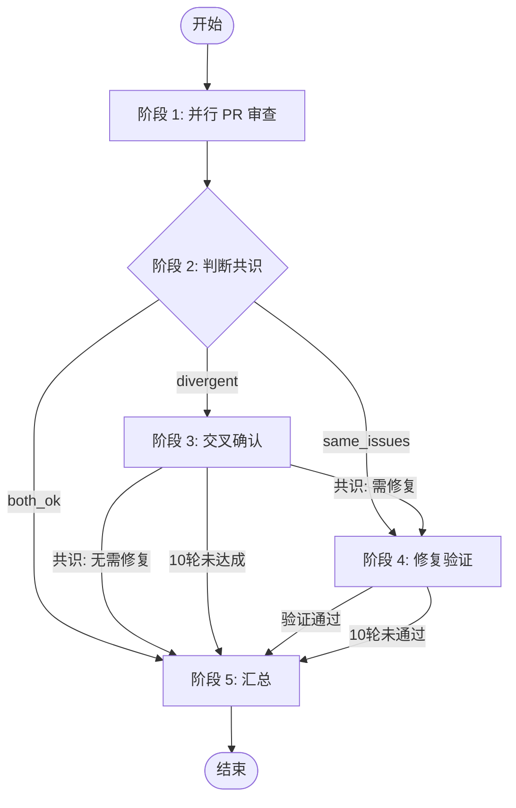

# Duo Review - 双 Agent 交叉审查

## 角色

| 角色             | 模型                | 职责                           |
| ---------------- | ------------------- | ------------------------------ |
| **Orchestrator** | 执行 skill 的 droid | 编排流程、判断共识、决定下一步 |
| **Codex**        | GPT-5.2             | PR 审查、交叉确认、验证修复    |
| **Opus**         | Claude Opus 4.5     | PR 审查、交叉确认、执行修复    |

## ⚠️ Orchestrator 行为规范

**禁止：** 读取 PR diff、REVIEW.md、代码文件
**必须：** 直接执行脚本，使用 Redis 协调状态，读取评论判断共识

## 五阶段总览



## 输入

- `PR_NUMBER`: PR 编号
- `PR_BRANCH`: PR 分支名
- `BASE_BRANCH`: 目标分支
- `REPO`: 仓库名（格式 owner/repo）

## 脚本路径

```bash
S=~/.factory/skills/duo-review/scripts
```

## 可用脚本

| 脚本                      | 用途         | 用法                                                                            |
| ------------------------- | ------------ | ------------------------------------------------------------------------------- |
| `$S/duo-init.sh`          | 初始化 Redis | `$S/duo-init.sh $PR_NUMBER $REPO $PR_BRANCH $BASE_BRANCH`                       |
| `$S/duo-set.sh`           | 设置状态     | `$S/duo-set.sh $PR_NUMBER <field> <value>`                                      |
| `$S/duo-get.sh`           | 获取状态     | `$S/duo-get.sh $PR_NUMBER <field>`                                              |
| `$S/duo-wait.sh`          | 等待条件     | `$S/duo-wait.sh $PR_NUMBER <field1> <value1> [...]`                             |
| `$S/duo-status.sh`        | 完整状态     | `$S/duo-status.sh $PR_NUMBER`                                                   |
| `$S/codex-exec.sh`        | 启动 Codex   | `$S/codex-exec.sh PR_NUMBER=N REPO=o/r CODEX_COMMENT_ID=xxx BASE_BRANCH=main`   |
| `$S/opus-exec.sh`         | 启动 Opus    | `$S/opus-exec.sh PR_NUMBER=N REPO=o/r OPUS_COMMENT_ID=xxx BASE_BRANCH=main`     |
| `$S/codex-resume.sh`      | 恢复 Codex   | `$S/codex-resume.sh <session_id> "<prompt>"`                                    |
| `$S/opus-resume.sh`       | 恢复 Opus    | `$S/opus-resume.sh <session_id> "<prompt>"`                                     |
| `$S/post-comment.sh`      | 发评论       | `$S/post-comment.sh $PR_NUMBER $REPO "<body>"`                                  |
| `$S/edit-comment.sh`      | 编辑评论     | `echo "<body>" \| $S/edit-comment.sh <comment_id>`                              |
| `$S/cleanup-comments.sh`  | 清理评论     | `$S/cleanup-comments.sh $PR_NUMBER $REPO`                                       |

## Redis 状态结构

```plain
Key: duo:{PR_NUMBER}

# 元信息
repo, pr, branch, base, stage, started_at, progress_comment

# 阶段 1: PR 审查
s1:codex:status     pending | done
s1:codex:session    会话 ID
s1:codex:conclusion ok | p0 | p1 | p2 | p3
s1:codex:review     审查正文（完整内容）
s1:codex:review_node_id  评论 node ID（UI 指针）

s1:opus:*           同上

# 阶段 2: 共识结果
s2:result           both_ok | same_issues | divergent

# 阶段 3: 交叉确认
s3:mode             codex_confirm | opus_confirm | bidirectional
s3:round            当前轮数
s3:consensus        0 | 1
s3:need_fix         0 | 1
s3:opus:round:{n}:response   Opus 第 n 轮回应
s3:codex:round:{n}:response  Codex 第 n 轮回应

# 阶段 4: 修复验证
s4:round            当前轮数
s4:branch           修复分支名
s4:verified         0 | 1
```

## 阶段执行

**每个阶段执行前，必须先读取对应的 stages/ 文件获取详细指令！**

| 阶段 | 文件                          | 执行者               | 说明     |
| ---- | ----------------------------- | -------------------- | -------- |
| 1    | `stages/1-pr-review.md`       | Codex + Opus         | 并行审查 |
| 2    | `stages/2-judge-consensus.md` | Orchestrator         | 判断共识 |
| 3    | `stages/3-cross-confirm.md`   | Orchestrator + Agent | 交叉确认 |
| 4    | `stages/4-fix-verify.md`      | Opus + Codex         | 修复验证 |
| 5    | `stages/5-summary.md`         | Orchestrator         | 汇总     |

## 图标

```plain
Codex: 
Opus:  
Loading: 
```
