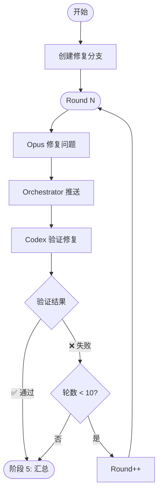

# 阶段 4: 修复验证（最多 10 轮）

**执行者**: Orchestrator + Opus + Codex

## 流程图



## 4.1 初始化

```bash
$S/duo-set.sh $PR_NUMBER stage 4
$S/duo-set.sh $PR_NUMBER s4:round 1
$S/duo-set.sh $PR_NUMBER s4:branch "bot/pr-$PR_NUMBER"

# 创建修复分支（-B 强制覆盖已存在的同名分支）
git checkout -B "bot/pr-$PR_NUMBER" "$PR_BRANCH"
```

---

## 循环（ROUND <= 10）

### 4.2 启动 Opus 修复

```bash
OPUS_SESSION=$($S/duo-get.sh $PR_NUMBER s1:opus:session)
ROUND=$($S/duo-get.sh $PR_NUMBER s4:round)

$S/opus-resume.sh $OPUS_SESSION "
## 任务
读取 PR 评论中双方都认可（✅）的问题，进行修复。

## 要求
- 只修复达成共识的问题
- 保持最小改动
- commit message: fix(duo): 简要描述

## 完成后
git add -A
git commit -m 'fix(duo): ...'
~/.factory/skills/duo-review/scripts/duo-set.sh $PR_NUMBER s4:opus:commit \$(git rev-parse HEAD)
~/.factory/skills/duo-review/scripts/duo-set.sh $PR_NUMBER s4:opus:status done

## 发布评论
~/.factory/skills/duo-review/scripts/post-comment.sh $PR_NUMBER $REPO \"评论内容\"

### 评论格式
<!-- duo-fix-opus -->
##  Opus 修复 | PR #$PR_NUMBER

### 修复内容
**Commit**: [\`<short_hash>\`](https://github.com/$REPO/commit/<full_hash>)

(说明修复了什么问题)

### 文件变更
(列出修改的文件及行数变更)
"
```

### 4.3 等待 Opus 修复

```bash
$S/duo-wait.sh $PR_NUMBER s4:opus:status done
```

### 4.4 推送修复

```bash
BRANCH=$($S/duo-get.sh $PR_NUMBER s4:branch)
git push origin "$BRANCH" --force
```

### 4.5 启动 Codex 验证

```bash
CODEX_SESSION=$($S/duo-get.sh $PR_NUMBER s1:codex:session)

$S/codex-resume.sh $CODEX_SESSION "
## 任务
验证 Opus 的修复是否正确。

## 步骤
git diff origin/$PR_BRANCH..HEAD

## 检查项
1. 问题是否真正解决
2. 是否引入新问题
3. 代码质量是否符合规范

## 完成后
- 验证通过: ~/.factory/skills/duo-review/scripts/duo-set.sh $PR_NUMBER s4:verified 1
- 验证失败: ~/.factory/skills/duo-review/scripts/duo-set.sh $PR_NUMBER s4:verified 0
然后: ~/.factory/skills/duo-review/scripts/duo-set.sh $PR_NUMBER s4:codex:status done

## 发布评论
~/.factory/skills/duo-review/scripts/post-comment.sh $PR_NUMBER $REPO \"评论内容\"

### 评论格式
<!-- duo-verify-codex -->
##  Codex 验证 | PR #$PR_NUMBER

### 验证结果
(✅ 通过 / ❌ 失败 + 原因)
"
```

### 4.6 等待 Codex 验证

```bash
$S/duo-wait.sh $PR_NUMBER s4:codex:status done
```

### 4.7 判断结果

```bash
VERIFIED=$($S/duo-get.sh $PR_NUMBER s4:verified)
ROUND=$($S/duo-get.sh $PR_NUMBER s4:round)

if [ "$VERIFIED" = "1" ]; then
  # 验证通过 → 阶段 5
  echo "修复验证通过"
  
elif [ "$ROUND" -ge 10 ]; then
  # 达到最大轮数 → 阶段 5
  echo "达到最大轮数"
  
else
  # 验证失败，继续下一轮
  $S/duo-set.sh $PR_NUMBER s4:opus:status pending
  $S/duo-set.sh $PR_NUMBER s4:codex:status pending
  $S/duo-set.sh $PR_NUMBER s4:round $((ROUND + 1))
  # → 继续循环
fi
```

---

## 退出条件

1. `s4:verified = 1` → 阶段 5（修复成功）
2. `s4:round > 10` → 阶段 5（标记修复未完成）
