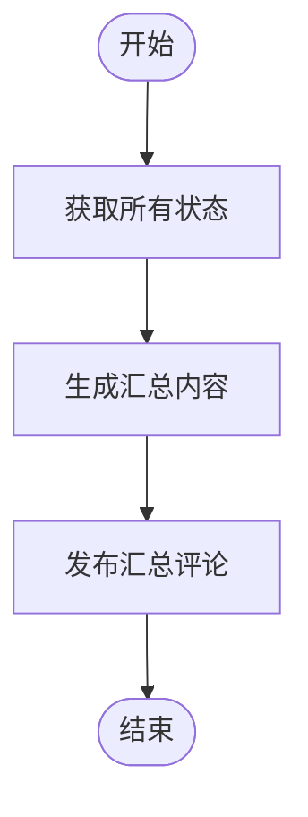

# 阶段 5: 汇总

**执行者**: Orchestrator

## 流程图



## 5.1 获取状态

 ⚠️ 重要：使用 Python 生成汇总

**禁止使用 bash heredoc 生成汇总**，因为 markdown 中的反引号会被 bash 当作命令替换执行。

必须使用 Python 脚本生成：

```bash
$S/duo-set.sh $PR_NUMBER stage 5

SUMMARY=$(python3 - <<'PY'
import os, subprocess
S = os.path.expanduser('~/.factory/skills/duo-review/scripts')
PR = '$PR_NUMBER'

def get(field):
    return subprocess.check_output([S + '/duo-get.sh', PR, field], text=True).strip()

repo = get('repo')
pr_branch = get('branch')
result = get('s2:result')
codex_conc = get('s1:codex:conclusion')
opus_conc = get('s1:opus:conclusion')
codex_session = get('s1:codex:session')
opus_session = get('s1:opus:session')
consensus = get('s3:consensus')
need_fix = get('s3:need_fix')
verified = get('s4:verified')
fix_branch = get('s4:branch')
round_n = get('s3:round')

# 根据情况选择模板（见下方 5.2）
# ...生成 summary 字符串...

print(summary)
PY
)

$S/post-comment.sh $PR_NUMBER $REPO "$SUMMARY"
```

## 5.2 根据情况生成汇总

### 情况 A: both_ok（双方都没发现问题）

```markdown
<!-- duo-review-summary -->
## ✅ Duo Review | PR #$PR_NUMBER

| Agent                                                                                                   | 结论         |
| ------------------------------------------------------------------------------------------------------- | ------------ |
|  Codex      | ✅ 未发现问题 |
|  Opus | ✅ 未发现问题 |

**结论**: 双方审查员均未发现问题，PR 可以合并。

<details>
<summary>Session IDs</summary>

- Codex: `$CODEX_SESSION`
- Opus: `$OPUS_SESSION`
</details>
```

### 情况 B: same_issues + 修复验证通过

```markdown
<!-- duo-review-summary -->
## ✅ Duo Review | PR #$PR_NUMBER

| Agent                                                                                                   | 结论                  |
| ------------------------------------------------------------------------------------------------------- | --------------------- |
|  Codex      | 发现问题 → ✅ 验证通过 |
|  Opus | 发现问题 → ✅ 已修复   |

**修复分支**: [`bot🤖/pr-$PR_NUMBER`](https://github.com/$REPO/compare/$PR_BRANCH...bot🤖/pr-$PR_NUMBER)

**结论**: 问题已修复并验证通过。

<details>
<summary>Session IDs</summary>

- Codex: `$CODEX_SESSION`
- Opus: `$OPUS_SESSION`
</details>
```

### 情况 C: divergent + 达成共识 + 修复

```markdown
<!-- duo-review-summary -->
## ✅ Duo Review | PR #$PR_NUMBER

| Agent                                                                                                   | 结论              |
| ------------------------------------------------------------------------------------------------------- | ----------------- |
|  Codex      | $CODEX_CONCLUSION |
|  Opus | $OPUS_CONCLUSION  |

**交叉确认**: 第 N 轮达成共识
**修复分支**: [`bot🤖/pr-$PR_NUMBER`](https://github.com/$REPO/compare/$PR_BRANCH...bot🤖/pr-$PR_NUMBER)

**结论**: 问题已修复并验证通过。

<details>
<summary>Session IDs</summary>

- Codex: `$CODEX_SESSION`
- Opus: `$OPUS_SESSION`
</details>
```

### 情况 D: divergent + 达成共识 + 无需修复

```markdown
<!-- duo-review-summary -->
## ✅ Duo Review | PR #$PR_NUMBER

| Agent                                                                                                   | 结论              |
| ------------------------------------------------------------------------------------------------------- | ----------------- |
|  Codex      | $CODEX_CONCLUSION |
|  Opus | $OPUS_CONCLUSION  |

**交叉确认**: 第 N 轮达成共识

**结论**: 经交叉确认，无需修复，PR 可以合并。

<details>
<summary>Session IDs</summary>

- Codex: `$CODEX_SESSION`
- Opus: `$OPUS_SESSION`
</details>
```

### 情况 E: 未达成共识或修复未验证

```markdown
<!-- duo-review-summary -->
## ⚠️ Duo Review | PR #$PR_NUMBER

| Agent                                                                                                   | 结论              |
| ------------------------------------------------------------------------------------------------------- | ----------------- |
|  Codex      | $CODEX_CONCLUSION |
|  Opus | $OPUS_CONCLUSION  |

**交叉确认**: 共 N 轮，未达成共识

**结论**: ⚠️ 需人工审查。请查看评论详情。

<details>
<summary>Session IDs</summary>

- Codex: `$CODEX_SESSION`
- Opus: `$OPUS_SESSION`
</details>
```

## 5.3 发布汇总评论

```bash
$S/post-comment.sh $PR_NUMBER $REPO "$SUMMARY_CONTENT"
```

## 清理

Redis 会在 2 小时后自动过期。
