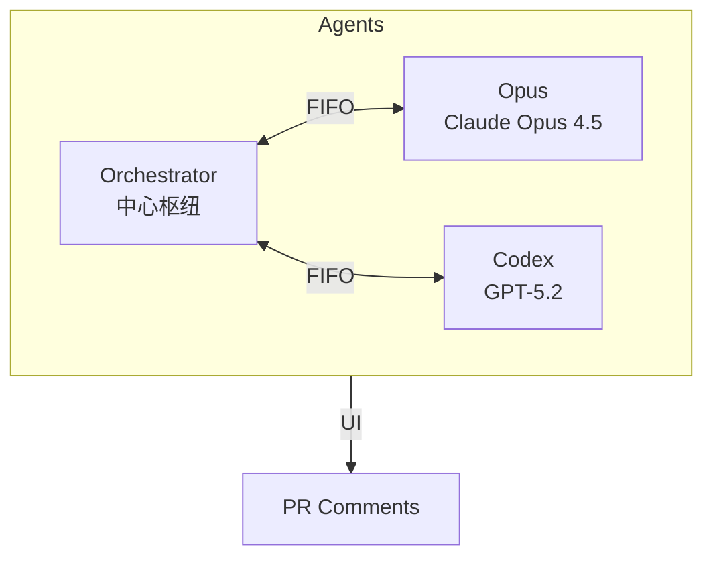
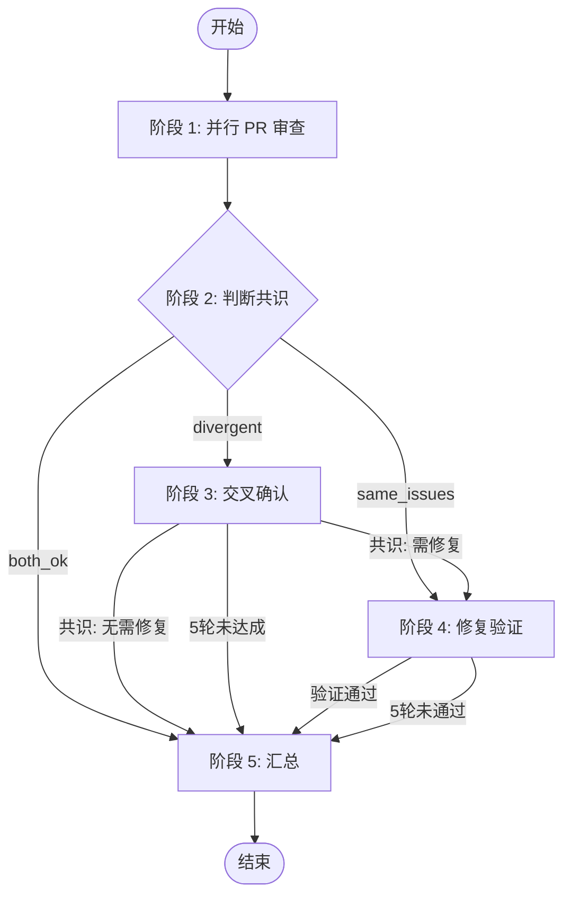

# Duo Review - 双 Agent 交叉审查

## ⚠️ 启动检测

执行 `echo $RUNNER` 检测环境变量：

**有输出** → 脚本启动，跳过确认，直接执行阶段流程

**无输出** → 用户直接启动，进入交互模式：

1. 执行 `gh pr view --json number,baseRefName,headRefName` 获取 PR 信息
2. 向用户确认："检测到 PR #XX (head → base)，开始审查？"
3. 用户确认后执行：

   ```bash
   export RUNNER=droid
   ~/.factory/skills/duoduo/scripts/duo-run.sh $PR_NUMBER
   ```

4. 若检测不到 PR，询问用户输入 PR 编号

**⛔ 禁止**：如果 `duo-run.sh` 执行失败，**禁止**自己手动调用 `duo-init.sh` 或其他脚本来"修复"。直接报错并告知用户。

## 角色

| 角色             | 模型                | 职责                           |
| ---------------- | ------------------- | ------------------------------ |
| **Orchestrator** | 执行 skill 的 droid | 编排流程、判断共识、决定下一步 |
| **Codex**        | GPT-5.2             | PR 审查、交叉确认、验证修复    |
| **Opus**         | Claude Opus 4.5     | PR 审查、交叉确认、执行修复    |

## 通信架构



- **FIFO** = 数据通道（双向通信）
- **评论** = 纯 UI（给人看，不参与数据流）

## ⚠️ Orchestrator 行为规范

**禁止：**

- 读取 PR diff、REVIEW.md、代码文件
- 等待 Agent 时执行任何命令（FIFO 消息会丢失！）

**必须：**

- 启动 Agent 后直接回复"等待中..."然后结束回复
- Agent 结果会自动作为新消息发来：`<OPUS>...</OPUS>` / `<CODEX>...</CODEX>`

## 五阶段总览



## 输入

- `PR_NUMBER`: PR 编号
- `PR_BRANCH`: PR 分支名
- `BASE_BRANCH`: 目标分支
- `REPO`: 仓库名（格式 owner/repo）

## 脚本路径

```bash
S=~/.factory/skills/duoduo/scripts
```

## 可用脚本

| 脚本                 | 用途               | 用法                                                               |
| -------------------- | ------------------ | ------------------------------------------------------------------ |
| `$S/duo-init.sh`     | 初始化 Redis       | `$S/duo-init.sh $PR_NUMBER $REPO $PR_BRANCH $BASE_BRANCH [RUNNER]` |
| `$S/duo-set.sh`      | 设置状态           | `$S/duo-set.sh $PR_NUMBER <field> <value>`                         |
| `$S/duo-get.sh`      | 获取状态           | `$S/duo-get.sh $PR_NUMBER <field>`                                 |
| `$S/opus-start.py`   | 启动 Opus session  | `$S/opus-start.py $COMMENT_ID`                                     |
| `$S/codex-start.py`  | 启动 Codex session | `$S/codex-start.py $COMMENT_ID`                                    |
| `$S/fifo-send.sh`    | 给 session 发消息  | `$S/fifo-send.sh <orchestrator\|opus\|codex> $PR "<msg>"`          |
| `$S/post-comment.sh` | 发评论             | `$S/post-comment.sh $PR_NUMBER $REPO "<body>"`                     |
| `$S/edit-comment.sh` | 编辑评论           | `echo "<body>" \| $S/edit-comment.sh <comment_id>`                 |
| `$S/get-comment.sh`  | 读取评论           | `$S/get-comment.sh $PR_NUMBER $REPO <marker>`                      |

## Redis 状态结构

```plain
Key: duo:{PR_NUMBER}

# 元信息（duo-init.sh 初始化）
repo, pr, branch, base, runner, stage, started_at

# Session 管理（session-start.py 自动写入）
orchestrator:session, orchestrator:fifo, orchestrator:pid, orchestrator:log
opus:session, opus:fifo, opus:pid, opus:log
codex:session, codex:fifo, codex:pid, codex:log

# 评论 ID（Orchestrator 写入，阶段 1 创建占位评论后保存）
s1:codex:comment_id
s1:opus:comment_id

# 阶段结果（Orchestrator 写入）
s2:result           both_ok | same_issues | divergent

# 阶段 4 状态（Opus 写入）
s4:branch           修复分支名（格式: duo/pr<PR>-<desc>）
```

## 阶段执行

**每个阶段执行前，必须先读取对应的 stages/ 文件获取详细指令！**

| 阶段 | 文件                          | 执行者               | 说明     |
| ---- | ----------------------------- | -------------------- | -------- |
| 1    | `stages/1-pr-review.md`       | Codex + Opus         | 并行审查 |
| 2    | `stages/2-judge-consensus.md` | Orchestrator         | 判断共识 |
| 3    | `stages/3-cross-confirm.md`   | Orchestrator + Agent | 交叉确认 |
| 4    | `stages/4-fix-verify.md`      | Opus + Codex         | 修复验证 |
| 5    | `stages/5-summary.md`         | Orchestrator         | 汇总     |

## 图标

```plain
Codex: 
Opus:  
Codex Loading: 
Opus Loading:  
```
