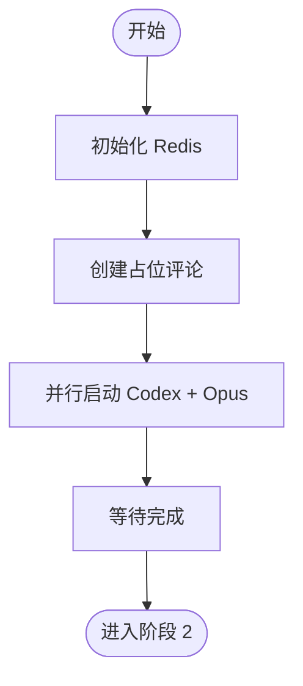

# 阶段 1: 并行 PR 审查

**执行者**: Orchestrator + Codex + Opus

## 流程图



## ⚠️ 重要规则

1. **禁止读取 diff** - 直接执行脚本，不要先看 PR 内容
2. **必须并行启动** - Codex 和 Opus 的启动脚本会在后台运行

## 1.1 初始化 Redis

```bash
$S/duo-init.sh $PR_NUMBER $REPO $PR_BRANCH $BASE_BRANCH $RUNNER
```

## 1.2 创建占位评论

生成当前时间戳和随机 -ing 词（自己想一个），格式：

```bash
TIMESTAMP=$(TZ='Asia/Shanghai' date '+%Y-%m-%d %H:%M')

OPUS_COMMENT=$($S/post-comment.sh $PR_NUMBER $REPO "<!-- duo-opus-r1 -->
##  Opus 审查中
> 🕐 $TIMESTAMP

 {随机ing词}...")

CODEX_COMMENT=$($S/post-comment.sh $PR_NUMBER $REPO "<!-- duo-codex-r1 -->
##  Codex 审查中
> 🕐 $TIMESTAMP

 {随机ing词}...")

$S/duo-set.sh $PR_NUMBER s1:codex:comment_id "$CODEX_COMMENT"
$S/duo-set.sh $PR_NUMBER s1:opus:comment_id "$OPUS_COMMENT"
```

**{随机 ing 词}**: 自己想一个 -ing 结尾的词或短语，如 Thinking, Vibing, Cooking something up 等。

## 1.3 并行启动审查

**使用 JSON-RPC + FIFO 模式启动 session**

### 启动 Opus

```bash
$S/opus-start.py $OPUS_COMMENT
```

### 启动 Codex

```bash
$S/codex-start.py $CODEX_COMMENT
```

**注意**: 脚本会自动创建 session、发送审查指令。

## 1.4 等待 Agent 完成

**⚠️ 禁止执行任何命令！** 包括 duo-wait.sh、cat FIFO 等。

启动 Agent 后，直接回复"等待 Agent 完成..."然后**结束你的回复**。

Agent 的结果会**自动**作为新消息发给你：

- `<OPUS>评论内容</OPUS>`
- `<CODEX>评论内容</CODEX>`

收到两条消息后，从评论内容的 Conclusion 部分判断结果 → 进入阶段 2
