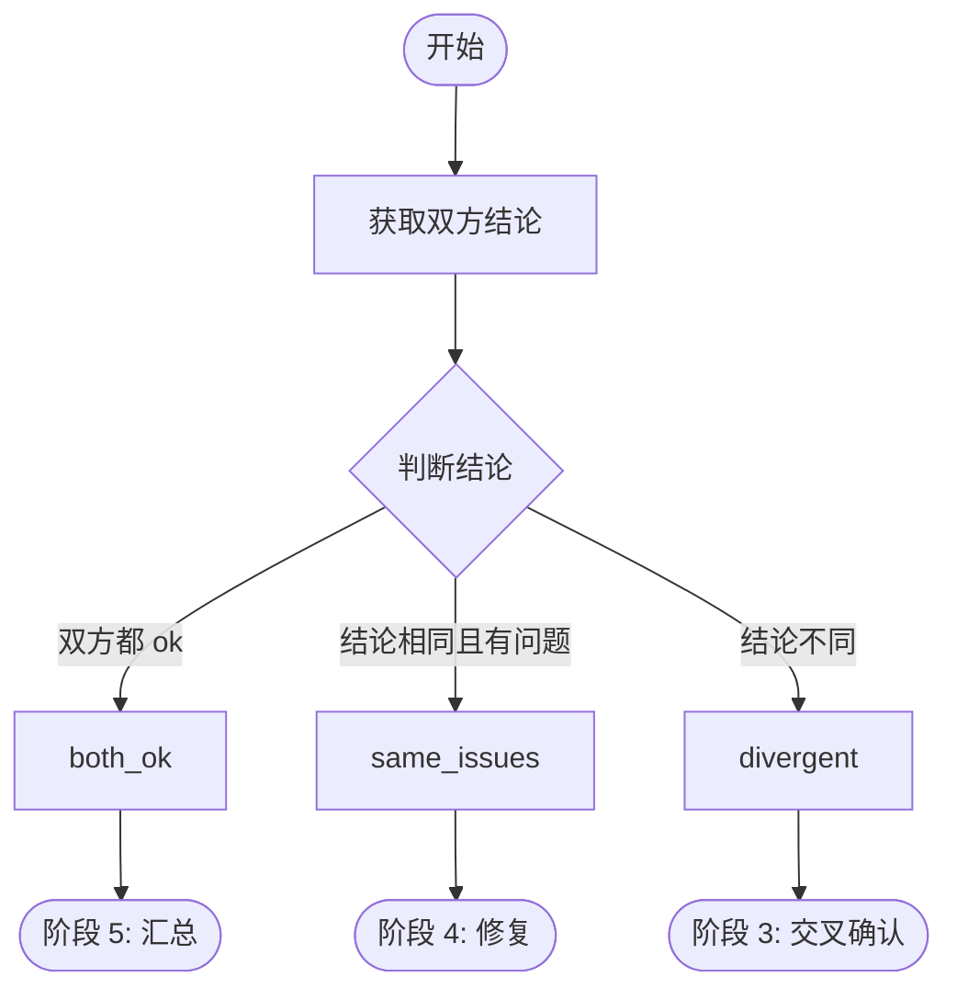

# 阶段 2: 判断共识

**执行者**: Orchestrator

## 流程图



## 2.1 获取结论

```bash
$S/duo-set.sh $PR_NUMBER stage 2
CODEX=$($S/duo-get.sh $PR_NUMBER s1:codex:conclusion)
OPUS=$($S/duo-get.sh $PR_NUMBER s1:opus:conclusion)
```

## 2.2 判断逻辑

```bash
if [ "$CODEX" = "ok" ] && [ "$OPUS" = "ok" ]; then
  # 双方都没发现问题
  $S/duo-set.sh $PR_NUMBER s2:result both_ok
  # → 阶段 5
  
elif [ "$CODEX" = "$OPUS" ]; then
  # 双方发现相同级别的问题（如都是 p1）
  $S/duo-set.sh $PR_NUMBER s2:result same_issues
  # → 阶段 4
  
else
  # 有分歧（一方 ok 另一方有问题，或双方问题级别不同）
  $S/duo-set.sh $PR_NUMBER s2:result divergent
  # → 阶段 3
fi
```

## 决策矩阵

| Codex | Opus | 结果 | 下一阶段 |
|-------|------|------|----------|
| ok | ok | both_ok | 5 |
| p0 | p0 | same_issues | 4 |
| p1 | p1 | same_issues | 4 |
| p2 | p2 | same_issues | 4 |
| ok | p1 | divergent | 3 |
| p0 | ok | divergent | 3 |
| p0 | p2 | divergent | 3 |
| ... | ... | divergent | 3 |

## 输出

- `s2:result = both_ok | same_issues | divergent`

→ 根据结果进入对应阶段
